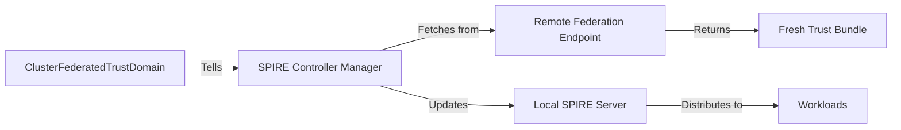

# Why ClusterFederatedTrustDomain is Needed

## Quick Answer

**ClusterFederatedTrustDomain** is what makes **automatic trust bundle rotation** work. Without it, your federation will break after ~24 hours when trust bundles expire!

---

## The Problem

When you manually bootstrap federation (copy trust bundles between clusters), you face a critical issue:

```
Time 0:    Trust bundles exchanged manually ✅
Time 12h:  Everything still works ✅
Time 24h:  Trust bundles expire ❌
Result:    Federation breaks! Cross-cluster communication fails!
```

**Manual trust bundle exchange is ONE-TIME and static** - bundles don't update automatically.

---

## The Solution: ClusterFederatedTrustDomain

ClusterFederatedTrustDomain tells the **SPIRE Controller Manager** to:
1. Automatically fetch fresh trust bundles from the remote cluster
2. Update them in the local SPIRE server
3. Do this every ~5 minutes (configurable)
4. Keep federation working indefinitely

---

## How It Works

### Setup Overview

```
┌─────────────────────────────────────────────────────────────┐
│  Manual Setup (ONE-TIME)                                    │
├─────────────────────────────────────────────────────────────┤
│  1. Configure SPIRE Server with federates_with block        │
│  2. Expose federation endpoint (Service + Route)            │
│  3. Manually bootstrap initial trust bundles (SPIRE CLI)    │
│  4. Create ClusterFederatedTrustDomain ← ENABLES AUTO-ROTATION│
└─────────────────────────────────────────────────────────────┘
                             │
                             ▼
┌─────────────────────────────────────────────────────────────┐
│  Automatic Operation (CONTINUOUS)                           │
├─────────────────────────────────────────────────────────────┤
│  Every ~5 minutes:                                          │
│  1. SPIRE Controller Manager reads ClusterFederatedTrustDomain│
│  2. Fetches fresh bundle from remote federation endpoint    │
│  3. Updates local SPIRE server with new bundle              │
│  4. Schedules next refresh                                  │
└─────────────────────────────────────────────────────────────┘
```

### Detailed Flow



---

## What ClusterFederatedTrustDomain Contains

### Example Resource

```yaml
apiVersion: spire.spiffe.io/v1alpha1
kind: ClusterFederatedTrustDomain
metadata:
  name: cluster-2-federation
spec:
  # Which trust domain to federate with
  trustDomain: apps.server-1.devcluster.openshift.com
  
  # Where to fetch the trust bundle from
  bundleEndpointURL: https://spire-server-federation-zero-trust-workload-identity-manager.apps.server-1.devcluster.openshift.com
  
  # How to authenticate when fetching
  bundleEndpointProfile:
    type: https_spiffe
    endpointSPIFFEID: spiffe://apps.server-1.devcluster.openshift.com/spire/server
  
  # Which SPIRE instance to update
  className: zero-trust-workload-identity-manager-spire
  
  # Initial trust bundle (from manual bootstrap)
  trustDomainBundle: |-
    {
      "trust_domain": "apps.server-1.devcluster.openshift.com",
      "x509_authorities": [
        {
          "asn1": "MIIEAz..."
        }
      ]
    }
```

### What Each Field Does

| Field | Purpose |
|-------|---------|
| `trustDomain` | Identifies which remote trust domain this is for |
| `bundleEndpointURL` | Where to fetch fresh bundles from |
| `bundleEndpointProfile.type` | Authentication method (https_spiffe or https_web) |
| `endpointSPIFFEID` | Expected SPIFFE ID of the remote endpoint (for https_spiffe) |
| `className` | Which SPIRE instance to update |
| `trustDomainBundle` | Bootstrap bundle (initial trust - gets updated automatically) |

---

## Why Both SPIRE Server Config AND ClusterFederatedTrustDomain?

You need **BOTH** because they serve different purposes:

### 1. SPIRE Server Configuration (`federates_with` block)

**Purpose**: Expose your own federation endpoint so others can fetch YOUR bundle

**What it does**:
- Starts federation endpoint on port 8443
- Serves your trust bundle to remote clusters
- Defines WHO can fetch your bundle

**Analogy**: Your phone number - so others can call YOU

**Configuration**:
```json
{
  "server": {
    "federation": {
      "bundle_endpoint": {
        "address": "0.0.0.0",
        "port": 8443
      },
      "federates_with": {
        "apps.server-1.devcluster.openshift.com": {
          "bundle_endpoint_url": "https://...",
          ...
        }
      }
    }
  }
}
```

### 2. ClusterFederatedTrustDomain

**Purpose**: Fetch trust bundles FROM other clusters automatically

**What it does**:
- Tells controller WHERE to fetch remote bundles from
- Enables automatic refresh every ~5 minutes
- Keeps your local SPIRE server updated with fresh bundles

**Analogy**: Contact list - so YOU can call others

**Resource**:
```yaml
apiVersion: spire.spiffe.io/v1alpha1
kind: ClusterFederatedTrustDomain
metadata:
  name: remote-cluster-federation
spec:
  trustDomain: apps.remote.example.com
  bundleEndpointURL: https://remote-federation-endpoint
  ...
```

---

## What Happens Without ClusterFederatedTrustDomain?

### Scenario: No ClusterFederatedTrustDomain

```
Time 0:    Manual bootstrap ✅
           - SPIRE server has federates_with config ✅
           - Federation endpoint exposed ✅
           - Trust bundles manually copied ✅
           - Federation works! ✅

Time 5min: No automatic refresh ⚠️
           - Trust bundles are stale but still valid
           - Federation still works

Time 1h:   Trust bundles getting old ⚠️
           - Still within validity period
           - Federation still works

Time 24h:  Trust bundles EXPIRED ❌
           - Certificates rotated on remote cluster
           - Local SPIRE has OLD bundle
           - Cannot verify remote identities
           - Federation BREAKS! ❌
```

### Scenario: With ClusterFederatedTrustDomain

```
Time 0:    Manual bootstrap + ClusterFederatedTrustDomain ✅
           - Initial setup complete

Time 5min: Auto refresh #1 ✅
           - Controller fetches fresh bundle
           - Local SPIRE updated

Time 10min: Auto refresh #2 ✅
Time 15min: Auto refresh #3 ✅
...
Time 24h:  Auto refresh #288 ✅
           - Trust bundles always fresh
           - Federation keeps working! ✅

Time 30d:  Still working! ✅
Time 365d: Still working! ✅
```

---

## Real Example from Your Setup

### On Cluster 1, you have TWO ClusterFederatedTrustDomain resources:

#### 1. For Cluster 2
```yaml
apiVersion: spire.spiffe.io/v1alpha1
kind: ClusterFederatedTrustDomain
metadata:
  name: cluster-2-federation
spec:
  trustDomain: apps.server-1.devcluster.openshift.com
  bundleEndpointURL: https://spire-server-federation-zero-trust-workload-identity-manager.apps.server-1.devcluster.openshift.com
  # Tells controller to fetch Cluster 2's bundle from this URL
```

#### 2. For Cluster 3
```yaml
apiVersion: spire.spiffe.io/v1alpha1
kind: ClusterFederatedTrustDomain
metadata:
  name: cluster-3-federation
spec:
  trustDomain: apps.aagnihot-cluster-fss.devcluster.openshift.com
  bundleEndpointURL: https://spire-server-federation-zero-trust-workload-identity-manager.apps.aagnihot-cluster-fss.devcluster.openshift.com
  # Tells controller to fetch Cluster 3's bundle from this URL
```

### Result:
- Cluster 1 automatically stays updated with trust bundles from Cluster 2 and Cluster 3
- Each refresh ~75 seconds (seen in your logs!)
- Federation works indefinitely without manual intervention

---

## Key Differences

| Aspect | SPIRE Server federates_with | ClusterFederatedTrustDomain |
|--------|----------------------------|----------------------------|
| **Who manages it** | Operator (generates config) | SPIRE Controller Manager |
| **Purpose** | Serve YOUR bundle to others | Fetch THEIR bundles for you |
| **Direction** | Outbound (they fetch from you) | Inbound (you fetch from them) |
| **Frequency** | Always on (port 8443) | Every ~5 minutes refresh |
| **Required for** | Exposing your identity | Keeping their identities fresh |
| **Without it** | Others can't fetch your bundle | Your copy of their bundle goes stale |

---

## Manual Bootstrap: Why Still Needed?

Even with ClusterFederatedTrustDomain, you **MUST** manually bootstrap the FIRST time:

### Why?

**Security**: How does Cluster 1 trust Cluster 2's bundle for the FIRST time?

```
Cluster 1: "I got a bundle from Cluster 2, but how do I know it's legit?"
Security: "You must verify it out-of-band (manual process)"
```

**Chicken-and-egg problem**:
- ClusterFederatedTrustDomain fetches bundles via SPIFFE authentication
- SPIFFE authentication requires you already have their bundle
- First time: No bundle → Can't authenticate → Can't fetch bundle!

**Solution**: Manual bootstrap provides the initial trusted bundle

### Manual Bootstrap Process

```bash
# On Cluster 1, get Cluster 2's bundle
kubectl --kubeconfig cluster2 exec -n zero-trust-workload-identity-manager \
  spire-server-0 -c spire-server -- ./spire-server bundle show -format spiffe \
  > cluster2-bundle.json

# On Cluster 1, set Cluster 2's bundle
kubectl --kubeconfig cluster1 exec -n zero-trust-workload-identity-manager \
  spire-server-0 -c spire-server -- ./spire-server bundle set \
  -format spiffe -id apps.server-1.devcluster.openshift.com \
  < cluster2-bundle.json

# Now ClusterFederatedTrustDomain can take over and keep it updated!
```

---

## Verification Commands

### Check if ClusterFederatedTrustDomain is working:

```bash
# List resources
kubectl get clusterfederatedtrustdomain

# Check status (should show recent refresh timestamp)
kubectl get clusterfederatedtrustdomain cluster-2-federation -o yaml

# Watch logs for bundle refreshes
kubectl logs -f -n zero-trust-workload-identity-manager spire-server-0 -c spire-server | \
  grep "Bundle refresh"
```

### Expected output:
```
time="..." level=info msg="Bundle refreshed" subsystem_name=bundle_client trust_domain=apps.server-1.devcluster.openshift.com
time="..." level=debug msg="Scheduling next bundle refresh" at="2025-10-13T10:34:06Z"
```

Every ~75 seconds, you should see these messages!

---

## Summary

### What You Need for Working Federation

| Component | Purpose | One-time or Continuous |
|-----------|---------|----------------------|
| **SPIRE Server federates_with** | Expose YOUR federation endpoint | Continuous |
| **Federation Service** | Internal networking for endpoint | Continuous |
| **Federation Route** | External access to endpoint | Continuous |
| **Manual Bootstrap** | Initial trust establishment | ONE-TIME |
| **ClusterFederatedTrustDomain** ⭐ | **Automatic bundle rotation** | **Continuous** |

### Without ClusterFederatedTrustDomain:
❌ Federation breaks after ~24 hours  
❌ Must manually update bundles constantly  
❌ High operational burden  

### With ClusterFederatedTrustDomain:
✅ Federation works indefinitely  
✅ Automatic bundle rotation every ~5 minutes  
✅ Zero operational overhead  
✅ Production ready!  

---

## From Your Enhancement Document

As stated in `spire-federation-support.md`:

> **Automatic ClusterFederatedTrustDomain creation** - Users must create ClusterFederatedTrustDomain resources on each cluster for each federation relationship to enable automatic bundle rotation.

This is a **NON-GOAL** for the operator because:
- ClusterFederatedTrustDomain requires `trustDomainBundle` for bootstrapping
- Operator cannot obtain trust bundles without manual bootstrapping
- Better separation of concerns:
  - SpireServer configures **endpoint** (serving bundles)
  - ClusterFederatedTrustDomain configures **consumption** (fetching bundles)

---

## Conclusion

**ClusterFederatedTrustDomain is the bridge between manual one-time setup and continuous automatic operation.**

Without it: Federation is fragile and breaks  
With it: Federation is robust and self-maintaining

**This is why we created 6 ClusterFederatedTrustDomain resources (2 per cluster) in your 3-way federation setup!**

---

**See Also**:
- [SPIRE_FEDERATION_COMPLETE_GUIDE.md](SPIRE_FEDERATION_COMPLETE_GUIDE.md)
- [THREE_WAY_FEDERATION_COMPLETE.md](THREE_WAY_FEDERATION_COMPLETE.md)
- Enhancement document: `enhancements/enhancements/zero-trust-workload-identity-manager/spire-federation-support.md`


