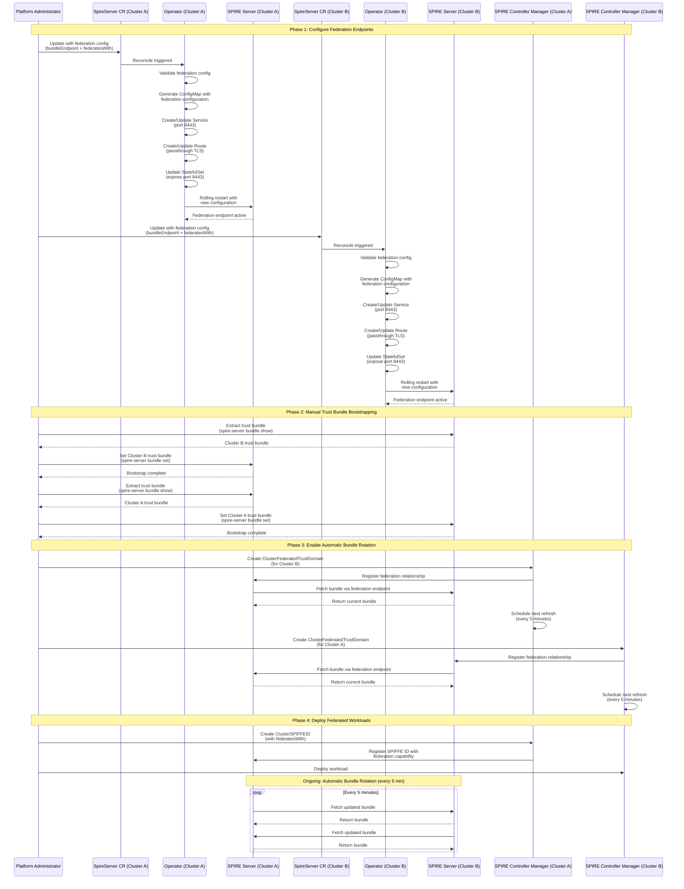
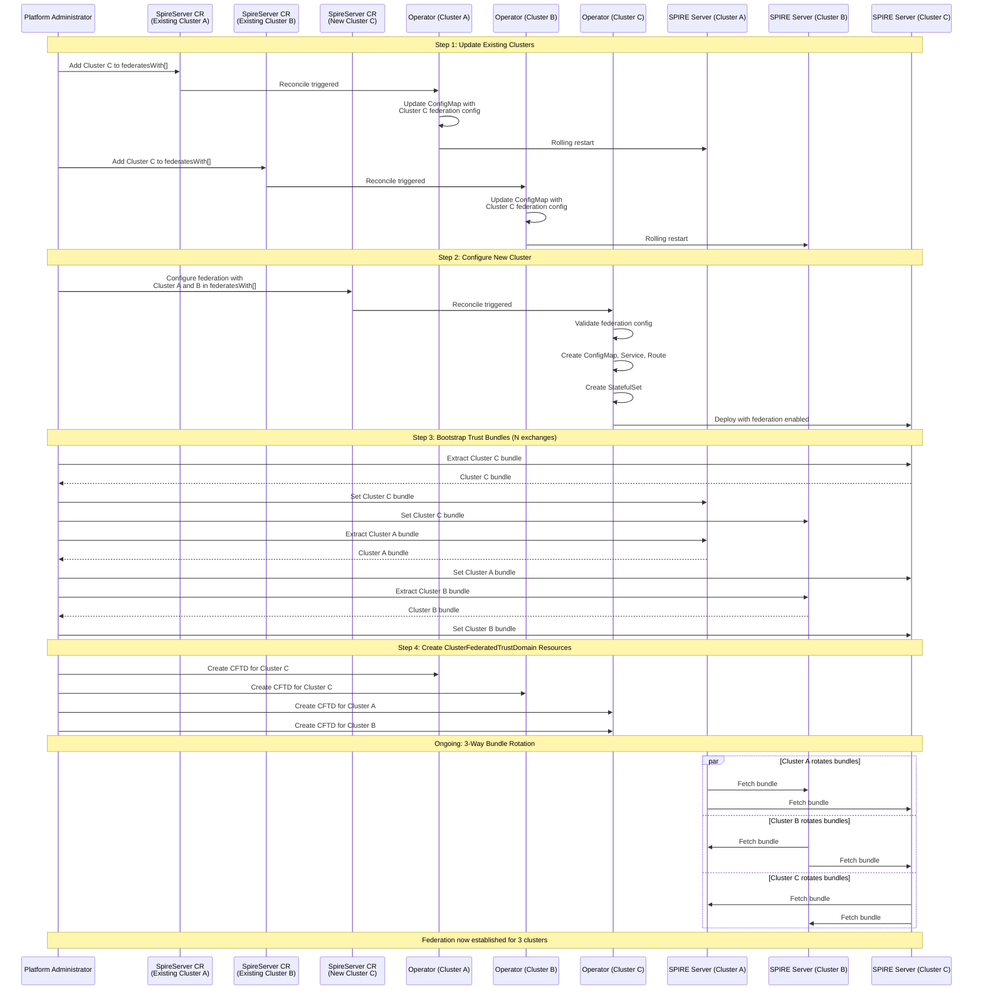

# SPIRE Federation Support for Zero Trust Workload Identity Manager

## Summary

This enhancement adds native support for SPIRE Federation in the Zero Trust Workload Identity Manager operator, enabling secure cross-cluster workload communication. The operator will manage federation endpoints, automate trust bundle exchange, and support federation between N clusters (where N is limited to a configurable maximum).

Currently, federation setup is a manual multi-step process requiring direct ConfigMap manipulation, manual trust bundle extraction, and route creation. This enhancement automates the entire federation lifecycle through declarative API configuration.

## Motivation

Organizations deploying workloads across multiple OpenShift clusters need secure service-to-service communication without exposing services to the public internet. SPIRE Federation enables workloads in one cluster to authenticate and communicate with workloads in another cluster using cryptographically verified identities (SVIDs). By adding federation support to the operator, we enable declarative, automated, and auditable federation management.

### User Stories

* As a platform engineer, I want to configure SPIRE federation declaratively in the SpireServer CR, so that I can manage federation through GitOps workflows.

* As a cluster administrator, I want the operator to automatically expose federation endpoints and manage routes, so that I don't have to manually create networking resources.

* As a security engineer, I want federation configuration to be validated at API admission time, so that misconfigurations are caught early.

* As a multi-cluster operator, I want to federate N clusters, so that workloads across my infrastructure can communicate securely.

* As a DevOps engineer, I want to add a new cluster to an existing federation without disrupting running workloads, so that I can scale my infrastructure dynamically.

* As an application developer, I want my workload to authenticate with services in federated clusters transparently, so that I can focus on application logic rather than cross-cluster authentication.

### Goals

1. Enable declarative federation configuration through SpireServer CR API
2. Automate federation endpoint exposure (Service, Route creation)
3. Support both `https_spiffe` and `https_web` bundle endpoint profiles
4. Support federation with N clusters (configurable limit)
5. Provide clear validation and error messages for federation misconfiguration
6. Enable incremental federation (adding N+1th cluster to existing N-cluster federation)
7. Document the manual trust bundle bootstrapping process
8. Ensure federation configuration is included in StatefulSet pod spec for proper restarts on configuration changes

### Non-Goals

1. **Automatic trust bundle bootstrapping** - Initial trust bundle exchange requires out-of-band secure communication and cannot be fully automated without compromising security. Users must manually bootstrap trust bundles using SPIRE CLI commands.

2. **Federation with unlimited clusters** - We impose a configurable limit to prevent performance degradation and misconfiguration. Operators can override this limit but will receive warnings.

3. **Automatic ClusterFederatedTrustDomain creation** - Users must create ClusterFederatedTrustDomain resources on each cluster for each federation relationship. The operator manages the federation endpoint but not the bidirectional relationship resources.

4. **Custom CA certificate management for https_web profile** - For https_web profile, users must provide valid certificates via Secrets or use ACME. The operator will not generate self-signed certificates.

5. **Federation across different SPIRE versions** - This enhancement assumes all clusters run compatible SPIRE versions as managed by the zero-trust-workload-identity-manager operator.

6. **Dynamic trust domain changes** - Changing trust domains in federated clusters requires recreating the federation from scratch. This is a SPIRE limitation, not an operator limitation.

## Proposal

This proposal adds federation configuration to the `SpireServerSpec` API and extends the spire-server controller to:

1. Generate federation configuration in spire-server ConfigMap
2. Create/update a Service to expose port 8443 for federation endpoint
3. Create/update an OpenShift Route to expose the federation endpoint externally
4. Update the StatefulSet to expose port 8443 and include federation configuration hash in pod annotations
5. Validate federation configuration at admission time

The operator will NOT automate trust bundle bootstrapping, as this requires secure out-of-band communication. Users must still perform initial trust bundle exchange using SPIRE CLI commands.

### Workflow Description

#### Actors
- **Platform Administrator**: Responsible for configuring federation between clusters
- **Zero Trust Workload Identity Manager Operator**: Manages SPIRE infrastructure
- **SPIRE Server**: Provides federation endpoints and manages trust bundles
- **SPIRE Controller Manager**: Reconciles ClusterFederatedTrustDomain resources
- **Application Developer**: Deploys workloads that use federation

#### Initial Federation Setup (Two Clusters)



1. Platform Administrator updates SpireServer CR on **Cluster A** with federation configuration:
   ```yaml
   apiVersion: operator.openshift.io/v1alpha1
   kind: SpireServer
   metadata:
     name: cluster
   spec:
     trustDomain: apps.cluster-a.example.com
     clusterName: cluster-a
     # ... existing fields ...
     federation:
       bundleEndpoint:
         port: 8443
         address: "0.0.0.0"
         profile: https_spiffe
       federatesWith:
       - trustDomain: apps.cluster-b.example.com
         bundleEndpointUrl: https://spire-server-federation-zero-trust-workload-identity-manager.apps.cluster-b.example.com
         bundleEndpointProfile: https_spiffe
         endpointSpiffeId: spiffe://apps.cluster-b.example.com/spire/server
   ```

2. Operator on **Cluster A** reconciles SpireServer CR:
   - Validates federation configuration
   - Updates spire-server ConfigMap with federation settings
   - Creates/updates Service `spire-server-federation` exposing port 8443
   - Creates/updates Route `spire-server-federation` with passthrough TLS
   - Updates StatefulSet to expose port 8443 container port
   - Restarts spire-server pod (via StatefulSet rolling update triggered by ConfigMap hash change)

3. Platform Administrator repeats steps 1-2 on **Cluster B**, pointing to **Cluster A**'s federation endpoint

4. Platform Administrator performs **manual trust bundle bootstrapping**:
   
   On **Cluster A**:
   ```bash
   # Extract trust bundle from Cluster B
   oc exec -n zero-trust-workload-identity-manager spire-server-0 -c spire-server -- \
     /opt/spire/bin/spire-server bundle show -format spiffe > cluster-b-bundle.json
   
   # Set Cluster A's trust bundle on Cluster B
   oc exec -n zero-trust-workload-identity-manager spire-server-0 -c spire-server -- \
     /opt/spire/bin/spire-server bundle set -format spiffe -id spiffe://apps.cluster-b.example.com < cluster-b-bundle.json
   ```
   
   On **Cluster B**:
   ```bash
   # Extract trust bundle from Cluster A
   oc exec -n zero-trust-workload-identity-manager spire-server-0 -c spire-server -- \
     /opt/spire/bin/spire-server bundle show -format spiffe > cluster-a-bundle.json
   
   # Set Cluster B's trust bundle on Cluster A
   oc exec -n zero-trust-workload-identity-manager spire-server-0 -c spire-server -- \
     /opt/spire/bin/spire-server bundle set -format spiffe -id spiffe://apps.cluster-a.example.com < cluster-a-bundle.json
   ```

5. Platform Administrator creates ClusterFederatedTrustDomain resources:
   
   On **Cluster A**:
   ```yaml
   apiVersion: spire.spiffe.io/v1alpha1
   kind: ClusterFederatedTrustDomain
   metadata:
     name: cluster-b-federation
   spec:
     trustDomain: apps.cluster-b.example.com
     bundleEndpointURL: https://spire-server-federation-zero-trust-workload-identity-manager.apps.cluster-b.example.com
     bundleEndpointProfile:
       type: https_spiffe
       endpointSPIFFEID: spiffe://apps.cluster-b.example.com/spire/server
     className: zero-trust-workload-identity-manager-spire
   ```
   
   On **Cluster B** (similar, pointing to Cluster A)

6. SPIRE Controller Manager reconciles ClusterFederatedTrustDomain and begins automatic bundle rotation

7. Application Developer deploys workloads with ClusterSPIFFEID resources that include `federatesWith` to enable cross-cluster communication

#### Adding N+1th Cluster to Existing Federation



1. Platform Administrator updates SpireServer CR on all existing N clusters to add the new cluster's federation endpoint to `federatesWith` array

2. Platform Administrator configures federation on the new (N+1th) cluster, adding all N existing clusters to its `federatesWith` array

3. Operator reconciles on all N+1 clusters, updating configurations

4. Platform Administrator performs trust bundle bootstrapping between the new cluster and all existing clusters (N trust bundle exchanges)

5. Platform Administrator creates ClusterFederatedTrustDomain resources on all N+1 clusters for all federation relationships (N new resources on the new cluster, 1 new resource on each existing cluster)

6. Federation is now established for N+1 clusters

#### Error Handling and Recovery

**Scenario: Invalid federation endpoint URL**

1. Platform Administrator updates SpireServer CR with malformed `bundleEndpointUrl`
2. Operator validates URL format and rejects the update with clear error message
3. Status condition `FederationConfigurationValid` is set to False
4. Administrator corrects the URL and reapplies

**Scenario: Federation endpoint not accessible**

1. Federation is configured correctly but Route is not accessible
2. SPIRE Server logs show bundle refresh failures
3. ClusterFederatedTrustDomain status shows last successful bundle refresh timestamp
4. Operator status condition shows Service/Route are created successfully
5. Administrator debugs networking (Route, ingress controller, firewall)

**Scenario: Trust bundle rotation failure**

1. Trust bundle becomes invalid or expired
2. SPIRE Server logs show validation errors
3. Workload SVID validation fails for cross-cluster requests
4. Administrator checks ClusterFederatedTrustDomain status for last refresh time
5. Administrator can manually re-bootstrap trust bundle if necessary

### API Extensions

This enhancement adds new fields to the existing `SpireServerSpec` API:

```go
type SpireServerSpec struct {
    // ... existing fields ...

    // Federation configures SPIRE federation endpoints and relationships
    // +kubebuilder:validation:Optional
    Federation *FederationConfig `json:"federation,omitempty"`
}

// FederationConfig defines federation bundle endpoint and federated trust domains
type FederationConfig struct {
    // BundleEndpoint configures this cluster's federation bundle endpoint
    // +kubebuilder:validation:Required
    BundleEndpoint BundleEndpointConfig `json:"bundleEndpoint"`

    // FederatesWith lists trust domains this cluster federates with
    // +kubebuilder:validation:Optional
    // +kubebuilder:validation:MaxItems=50
    FederatesWith []FederatedTrustDomain `json:"federatesWith,omitempty"`
}

// BundleEndpointConfig configures how this cluster exposes its federation bundle
type BundleEndpointConfig struct {
    // Port for the federation bundle endpoint
    // +kubebuilder:validation:Minimum=1
    // +kubebuilder:validation:Maximum=65535
    // +kubebuilder:default=8443
    Port int32 `json:"port"`

    // Address to bind the bundle endpoint to
    // +kubebuilder:default="0.0.0.0"
    Address string `json:"address"`

    // Profile is the bundle endpoint authentication profile
    // +kubebuilder:validation:Enum=https_spiffe;https_web
    // +kubebuilder:default=https_spiffe
    Profile BundleEndpointProfile `json:"profile"`

    // RefreshHint is the hint for bundle refresh interval in seconds
    // +kubebuilder:validation:Minimum=60
    // +kubebuilder:validation:Maximum=3600
    // +kubebuilder:default=300
    RefreshHint int32 `json:"refreshHint,omitempty"`

    // HttpsWeb configures the https_web profile (required if profile is https_web)
    // +kubebuilder:validation:Optional
    HttpsWeb *HttpsWebConfig `json:"httpsWeb,omitempty"`
}

// BundleEndpointProfile represents the authentication profile for bundle endpoint
// +kubebuilder:validation:Enum=https_spiffe;https_web
type BundleEndpointProfile string

const (
    // HttpsSpiffeProfile uses SPIFFE authentication (default, recommended)
    HttpsSpiffeProfile BundleEndpointProfile = "https_spiffe"
    
    // HttpsWebProfile uses Web PKI (X.509 certificates from public CA)
    HttpsWebProfile BundleEndpointProfile = "https_web"
)

// HttpsWebConfig configures https_web profile authentication
type HttpsWebConfig struct {
    // Acme configures automatic certificate management using ACME protocol
    // Mutually exclusive with ServingCert
    // +kubebuilder:validation:Optional
    Acme *AcmeConfig `json:"acme,omitempty"`

    // ServingCert configures certificate from a Kubernetes Secret
    // Mutually exclusive with Acme
    // +kubebuilder:validation:Optional
    ServingCert *ServingCertConfig `json:"servingCert,omitempty"`
}

// AcmeConfig configures ACME certificate provisioning
type AcmeConfig struct {
    // DirectoryUrl is the ACME directory URL (e.g., Let's Encrypt)
    // +kubebuilder:validation:Required
    // +kubebuilder:validation:Pattern=`^https://.*`
    DirectoryUrl string `json:"directoryUrl"`

    // DomainName is the domain name for the certificate
    // +kubebuilder:validation:Required
    DomainName string `json:"domainName"`

    // Email for ACME account registration
    // +kubebuilder:validation:Required
    // +kubebuilder:validation:Pattern=`^[a-zA-Z0-9._%+-]+@[a-zA-Z0-9.-]+\.[a-zA-Z]{2,}$`
    Email string `json:"email"`

    // TosAccepted indicates acceptance of Terms of Service
    // +kubebuilder:validation:Required
    TosAccepted bool `json:"tosAccepted"`
}

// ServingCertConfig references a Secret containing TLS certificate
type ServingCertConfig struct {
    // SecretName is the name of the Secret containing tls.crt and tls.key
    // +kubebuilder:validation:Required
    SecretName string `json:"secretName"`

    // FileSyncInterval is how often to check for certificate updates (seconds)
    // +kubebuilder:validation:Minimum=30
    // +kubebuilder:validation:Maximum=3600
    // +kubebuilder:default=300
    FileSyncInterval int32 `json:"fileSyncInterval,omitempty"`
}

// FederatedTrustDomain represents a remote trust domain to federate with
type FederatedTrustDomain struct {
    // TrustDomain is the federated trust domain name
    // +kubebuilder:validation:Required
    // +kubebuilder:validation:Pattern=`^[a-z0-9._-]{1,255}$`
    TrustDomain string `json:"trustDomain"`

    // BundleEndpointUrl is the URL of the remote federation endpoint
    // +kubebuilder:validation:Required
    // +kubebuilder:validation:Pattern=`^https://.*`
    BundleEndpointUrl string `json:"bundleEndpointUrl"`

    // BundleEndpointProfile is the authentication profile of remote endpoint
    // +kubebuilder:validation:Required
    // +kubebuilder:validation:Enum=https_spiffe;https_web
    BundleEndpointProfile BundleEndpointProfile `json:"bundleEndpointProfile"`

    // EndpointSpiffeId is required for https_spiffe profile
    // +kubebuilder:validation:Optional
    // +kubebuilder:validation:Pattern=`^spiffe://.*`
    EndpointSpiffeId string `json:"endpointSpiffeId,omitempty"`
}
```

**Validation Rules (via CEL or webhook):**

1. If `federation.bundleEndpoint.profile == "https_web"`, then `federation.bundleEndpoint.httpsWeb` must be set
2. If `httpsWeb` is set, exactly one of `acme` or `servingCert` must be specified (mutually exclusive)
3. If `federatesWith[*].bundleEndpointProfile == "https_spiffe"`, then `endpointSpiffeId` must be set
4. `federatesWith` array length must not exceed 50 (configurable via environment variable)
5. `federatesWith[*].trustDomain` must not equal `spec.trustDomain` (cannot federate with self)
6. `federatesWith[*].bundleEndpointUrl` must be valid HTTPS URL

This enhancement modifies the existing `SpireServer` CRD (operator.openshift.io/v1alpha1). It does NOT add new CRDs or webhooks.

The operator will use the existing ClusterFederatedTrustDomain CRD from spire-controller-manager (spire.spiffe.io/v1alpha1), which is already part of the operator's bundle.

### Topology Considerations

#### Hypershift / Hosted Control Planes

Federation support is applicable to Hypershift clusters with some considerations:

- **Management Cluster**: Not affected. The zero-trust-workload-identity-manager operator runs in guest clusters.
- **Guest Cluster**: Full federation support. Each guest cluster can federate independently with other guest clusters or standalone clusters.
- **Cross-management domain federation**: Guest clusters under different management clusters can federate normally, as federation uses Routes exposed via the cluster's ingress.

#### Standalone Clusters

Full federation support. This is the primary use case.

#### Single-node Deployments or MicroShift

- **Single-node OpenShift (SNO)**: Full support. SNO clusters can federate with other SNO or multi-node clusters.
- **MicroShift**: This enhancement is specific to the OpenShift zero-trust-workload-identity-manager operator and OpenShift Routes. MicroShift deployments would need separate implementation.

**Resource Impact on SNO**: 
- Additional memory: ~50MB for spire-server federation handling
- Additional CPU: Minimal, mostly during bundle refresh (default every 5 minutes)
- Network: Outbound HTTPS connections every 5 minutes for bundle refresh

### Implementation Details/Notes/Constraints

#### Operator Changes

**1. API Types** (`api/v1alpha1/spire_server_config_types.go`)

Add the new federation configuration types as specified in the API Extensions section.

**2. ConfigMap Generation** (`pkg/controller/spire-server/configmap.go`)

Update `generateServerConfMap()` to include federation configuration:

```go
func generateServerConfMap(config *v1alpha1.SpireServerSpec) map[string]interface{} {
    confMap := map[string]interface{}{
        // ... existing configuration ...
    }
    
    // Add federation configuration if present
    if config.Federation != nil {
        confMap["federation"] = generateFederationConfig(config.Federation)
    }
    
    return confMap
}

func generateFederationConfig(federation *v1alpha1.FederationConfig) map[string]interface{} {
    federationConf := map[string]interface{}{
        "bundle_endpoint": map[string]interface{}{
            "address": federation.BundleEndpoint.Address,
            "port":    federation.BundleEndpoint.Port,
        },
    }
    
    // Add profile-specific configuration
    if federation.BundleEndpoint.Profile == v1alpha1.HttpsSpiffeProfile {
        federationConf["bundle_endpoint"].(map[string]interface{})["acme"] = nil
    } else if federation.BundleEndpoint.Profile == v1alpha1.HttpsWebProfile {
        if federation.BundleEndpoint.HttpsWeb != nil {
            if federation.BundleEndpoint.HttpsWeb.Acme != nil {
                federationConf["bundle_endpoint"].(map[string]interface{})["acme"] = map[string]interface{}{
                    "directory_url": federation.BundleEndpoint.HttpsWeb.Acme.DirectoryUrl,
                    "domain_name":   federation.BundleEndpoint.HttpsWeb.Acme.DomainName,
                    "email":         federation.BundleEndpoint.HttpsWeb.Acme.Email,
                    "tos_accepted":  federation.BundleEndpoint.HttpsWeb.Acme.TosAccepted,
                }
            } else if federation.BundleEndpoint.HttpsWeb.ServingCert != nil {
                // Mount certificate from Secret to /run/spire/federation-certs/
                federationConf["bundle_endpoint"].(map[string]interface{})["serving_cert_file"] = map[string]interface{}{
                    "cert_file_path": "/run/spire/federation-certs/tls.crt",
                    "key_file_path":  "/run/spire/federation-certs/tls.key",
                }
            }
        }
    }
    
    // Add federates_with configuration
    if len(federation.FederatesWith) > 0 {
        federatesWith := make(map[string]interface{})
        for _, fedTrust := range federation.FederatesWith {
            trustConfig := map[string]interface{}{
                "bundle_endpoint_url": fedTrust.BundleEndpointUrl,
            }
            
            if fedTrust.BundleEndpointProfile == v1alpha1.HttpsSpiffeProfile {
                trustConfig["bundle_endpoint_profile"] = map[string]interface{}{
                    "https_spiffe": map[string]interface{}{
                        "endpoint_spiffe_id": fedTrust.EndpointSpiffeId,
                    },
                }
            } else {
                trustConfig["bundle_endpoint_profile"] = map[string]interface{}{
                    "https_web": map[string]interface{}{},
                }
            }
            
            federatesWith[fedTrust.TrustDomain] = trustConfig
        }
        federationConf["federates_with"] = federatesWith
    }
    
    return federationConf
}
```

**3. Service Creation** (`pkg/controller/static-resource-controller/service.go`)

Add new method to create/update federation Service:

```go
func (r *StaticResourceReconciler) ensureFederationService(ctx context.Context, server *v1alpha1.SpireServer, createOnlyMode bool) error {
    if server.Spec.Federation == nil {
        // No federation configured, ensure service is deleted if it exists
        return r.deleteFederationServiceIfExists(ctx)
    }
    
    federationSvc := &corev1.Service{
        ObjectMeta: metav1.ObjectMeta{
            Name:      "spire-server-federation",
            Namespace: utils.OperatorNamespace,
            Labels:    utils.SpireServerLabels(server.Spec.Labels),
        },
        Spec: corev1.ServiceSpec{
            Type: corev1.ServiceTypeClusterIP,
            Ports: []corev1.ServicePort{
                {
                    Name:       "federation",
                    Port:       server.Spec.Federation.BundleEndpoint.Port,
                    Protocol:   corev1.ProtocolTCP,
                    TargetPort: intstr.FromInt(int(server.Spec.Federation.BundleEndpoint.Port)),
                },
            },
            Selector: map[string]string{
                "app.kubernetes.io/name":     "spire-server",
                "app.kubernetes.io/instance": utils.StandardInstance,
            },
        },
    }
    
    return r.createOrUpdateResource(ctx, federationSvc, createOnlyMode, "Service")
}
```

**4. Route Creation** (`pkg/controller/spire-server/route.go` - new file)

Create new reconciler component for Route management:

```go
package spire_server

import (
    "context"
    
    routev1 "github.com/openshift/api/route/v1"
    metav1 "k8s.io/apimachinery/pkg/apis/meta/v1"
    "k8s.io/apimachinery/pkg/util/intstr"
    
    "github.com/openshift/zero-trust-workload-identity-manager/api/v1alpha1"
    "github.com/openshift/zero-trust-workload-identity-manager/pkg/controller/utils"
)

func (r *SpireServerReconciler) ensureFederationRoute(ctx context.Context, server *v1alpha1.SpireServer, createOnlyMode bool) error {
    if server.Spec.Federation == nil {
        // No federation configured, ensure route is deleted if it exists
        return r.deleteFederationRouteIfExists(ctx)
    }
    
    federationRoute := &routev1.Route{
        ObjectMeta: metav1.ObjectMeta{
            Name:      "spire-server-federation",
            Namespace: utils.OperatorNamespace,
            Labels:    utils.SpireServerLabels(server.Spec.Labels),
        },
        Spec: routev1.RouteSpec{
            To: routev1.RouteTargetReference{
                Kind: "Service",
                Name: "spire-server-federation",
            },
            Port: &routev1.RoutePort{
                TargetPort: intstr.FromString("federation"),
            },
            TLS: &routev1.TLSConfig{
                Termination:                   routev1.TLSTerminationPassthrough,
                InsecureEdgeTerminationPolicy: routev1.InsecureEdgeTerminationPolicyRedirect,
            },
        },
    }
    
    if err := controllerutil.SetControllerReference(server, federationRoute, r.scheme); err != nil {
        return fmt.Errorf("failed to set controller reference on federation route: %w", err)
    }
    
    var existingRoute routev1.Route
    err := r.ctrlClient.Get(ctx, types.NamespacedName{Name: federationRoute.Name, Namespace: federationRoute.Namespace}, &existingRoute)
    if err != nil && kerrors.IsNotFound(err) {
        if err = r.ctrlClient.Create(ctx, federationRoute); err != nil {
            return fmt.Errorf("failed to create federation route: %w", err)
        }
        r.log.Info("Created federation route")
    } else if err == nil {
        if createOnlyMode {
            r.log.Info("Skipping federation route update due to create-only mode")
        } else {
            // Update route if needed
            existingRoute.Spec = federationRoute.Spec
            if err = r.ctrlClient.Update(ctx, &existingRoute); err != nil {
                return fmt.Errorf("failed to update federation route: %w", err)
            }
            r.log.Info("Updated federation route")
        }
    } else if err != nil {
        return err
    }
    
    return nil
}
```

**5. StatefulSet Updates** (`pkg/controller/spire-server/statefulset.go`)

Update `GenerateSpireServerStatefulSet()` to expose federation port:

```go
func GenerateSpireServerStatefulSet(config *v1alpha1.SpireServerSpec, configHash, controllerConfigHash string) *appsv1.StatefulSet {
    // ... existing code ...
    
    // Add federation port if configured
    if config.Federation != nil {
        sts.Spec.Template.Spec.Containers[spireServerContainerIndex].Ports = append(
            sts.Spec.Template.Spec.Containers[spireServerContainerIndex].Ports,
            corev1.ContainerPort{
                Name:          "federation",
                ContainerPort: config.Federation.BundleEndpoint.Port,
                Protocol:      corev1.ProtocolTCP,
            },
        )
        
        // If using ServingCert, mount the Secret as volume
        if config.Federation.BundleEndpoint.HttpsWeb != nil && config.Federation.BundleEndpoint.HttpsWeb.ServingCert != nil {
            sts.Spec.Template.Spec.Volumes = append(sts.Spec.Template.Spec.Volumes, corev1.Volume{
                Name: "federation-certs",
                VolumeSource: corev1.VolumeSource{
                    Secret: &corev1.SecretVolumeSource{
                        SecretName: config.Federation.BundleEndpoint.HttpsWeb.ServingCert.SecretName,
                    },
                },
            })
            
            sts.Spec.Template.Spec.Containers[spireServerContainerIndex].VolumeMounts = append(
                sts.Spec.Template.Spec.Containers[spireServerContainerIndex].VolumeMounts,
                corev1.VolumeMount{
                    Name:      "federation-certs",
                    MountPath: "/run/spire/federation-certs",
                    ReadOnly:  true,
                },
            )
        }
    }
    
    return sts
}
```

**6. Controller Reconciliation** (`pkg/controller/spire-server/controller.go`)

Update `Reconcile()` to include federation resource management:

```go
func (r *SpireServerReconciler) Reconcile(ctx context.Context, req ctrl.Request) (ctrl.Result, error) {
    // ... existing code for ConfigMap, StatefulSet ...
    
    // Ensure federation Service exists if federation is configured
    if err := r.ensureFederationService(ctx, &server, createOnlyMode); err != nil {
        reconcileStatus["FederationService"] = reconcilerStatus{
            Status:  metav1.ConditionFalse,
            Reason:  "FederationServiceFailed",
            Message: err.Error(),
        }
        return ctrl.Result{}, err
    }
    
    // Ensure federation Route exists if federation is configured
    if err := r.ensureFederationRoute(ctx, &server, createOnlyMode); err != nil {
        reconcileStatus["FederationRoute"] = reconcilerStatus{
            Status:  metav1.ConditionFalse,
            Reason:  "FederationRouteFailed",
            Message: err.Error(),
        }
        return ctrl.Result{}, err
    }
    
    reconcileStatus["FederationConfiguration"] = reconcilerStatus{
        Status:  metav1.ConditionTrue,
        Reason:  "FederationConfigured",
        Message: "Federation resources applied successfully",
    }
    
    // ... rest of existing code ...
}
```

**7. Validation** (`pkg/controller/spire-server/validation.go`)

Add federation validation:

```go
func validateFederationConfig(federation *v1alpha1.FederationConfig, trustDomain string) error {
    if federation == nil {
        return nil
    }
    
    // Validate profile-specific configuration
    if federation.BundleEndpoint.Profile == v1alpha1.HttpsWebProfile {
        if federation.BundleEndpoint.HttpsWeb == nil {
            return fmt.Errorf("httpsWeb configuration is required when profile is https_web")
        }
        
        acmeSet := federation.BundleEndpoint.HttpsWeb.Acme != nil
        certSet := federation.BundleEndpoint.HttpsWeb.ServingCert != nil
        
        if acmeSet && certSet {
            return fmt.Errorf("acme and servingCert are mutually exclusive, only one can be set")
        }
        
        if !acmeSet && !certSet {
            return fmt.Errorf("either acme or servingCert must be set for https_web profile")
        }
    }
    
    // Validate federatesWith entries
    if len(federation.FederatesWith) > 50 {
        return fmt.Errorf("federatesWith array cannot exceed 50 entries, got %d", len(federation.FederatesWith))
    }
    
    for i, fedTrust := range federation.FederatesWith {
        // Cannot federate with self
        if fedTrust.TrustDomain == trustDomain {
            return fmt.Errorf("federatesWith[%d]: cannot federate with own trust domain %s", i, trustDomain)
        }
        
        // Validate URL format
        if !strings.HasPrefix(fedTrust.BundleEndpointUrl, "https://") {
            return fmt.Errorf("federatesWith[%d]: bundleEndpointUrl must use https://, got %s", i, fedTrust.BundleEndpointUrl)
        }
        
        // Validate https_spiffe requires endpointSpiffeId
        if fedTrust.BundleEndpointProfile == v1alpha1.HttpsSpiffeProfile {
            if fedTrust.EndpointSpiffeId == "" {
                return fmt.Errorf("federatesWith[%d]: endpointSpiffeId is required for https_spiffe profile", i)
            }
            if !strings.HasPrefix(fedTrust.EndpointSpiffeId, "spiffe://") {
                return fmt.Errorf("federatesWith[%d]: endpointSpiffeId must start with spiffe://, got %s", i, fedTrust.EndpointSpiffeId)
            }
        }
    }
    
    return nil
}
```

**8. Status Conditions**

Add new status conditions to SpireServerStatus:
- `FederationConfigurationValid`: Indicates if federation configuration is valid
- `FederationServiceReady`: Indicates if federation Service is created
- `FederationRouteReady`: Indicates if federation Route is created and accessible

#### SPIRE Server Configuration Output

Example generated `server.conf` with federation:

```json
{
  "server": {
    "trust_domain": "apps.cluster-a.example.com",
    // ... other server config ...
  },
  "federation": {
    "bundle_endpoint": {
      "address": "0.0.0.0",
      "port": 8443,
      "acme": null
    },
    "federates_with": {
      "apps.cluster-b.example.com": {
        "bundle_endpoint_url": "https://spire-server-federation-zero-trust-workload-identity-manager.apps.cluster-b.example.com",
        "bundle_endpoint_profile": {
          "https_spiffe": {
            "endpoint_spiffe_id": "spiffe://apps.cluster-b.example.com/spire/server"
          }
        }
      }
    }
  },
  // ... plugins, telemetry, etc ...
}
```

#### Constraints and Limitations

1. **Maximum Federated Clusters**: Default limit of N (configurable) clusters to prevent performance issues. Configurable via operator environment variable `MAX_FEDERATED_CLUSTERS`.

2. **Trust Bundle Bootstrapping**: Cannot be automated. Users MUST manually bootstrap trust bundles using SPIRE CLI. The operator will log warnings if ClusterFederatedTrustDomain resources are created before bootstrapping.

3. **Certificate Management for https_web**: Users are responsible for providing valid certificates via Secrets or configuring ACME correctly. Invalid certificates will cause federation to fail.

4. **Route Availability**: Federation requires OpenShift Routes. This will not work on vanilla Kubernetes without an Ingress controller that supports passthrough TLS.

5. **Network Connectivity**: All federated clusters must have network connectivity to each other's Routes. Private clusters or clusters behind restrictive firewalls may require additional network configuration.

6. **SPIRE Version Compatibility**: Federation requires SPIRE 1.5.0+. The operator already uses a compatible version.

### Risks and Mitigations

| Risk | Impact | Mitigation |
|------|--------|------------|
| **Misconfigured federation breaks cross-cluster communication** | High - workloads cannot communicate across clusters | - Comprehensive validation at API admission time<br>- Clear status conditions showing federation state<br>- Detailed documentation and examples<br>- E2E tests for common scenarios |
| **Manual trust bundle bootstrapping is error-prone** | High - federation won't work without correct bootstrapping | - Detailed step-by-step documentation<br>- Scripts/tools to assist with bootstrapping<br>- Validation that checks if trust bundles are set<br>- Status conditions showing bundle refresh status |
| **Route exposure creates security concerns** | Medium - federation endpoints are exposed externally | - Default to https_spiffe profile which requires SPIFFE authentication<br>- Document security best practices<br>- Support network policies to restrict access<br>- Federation uses mTLS by default |
| **Too many federated clusters cause performance degradation** | Medium - SPIRE server becomes slow or unstable | - Enforce maximum limit <br>- Document performance characteristics<br>- Provide monitoring metrics for federation<br>- Test with maximum number of clusters |
| **Changing federation configuration causes pod restarts** | Low - temporary service disruption during updates | - Use rolling updates for StatefulSet<br>- ConfigMap hash in pod annotations ensures controlled restarts<br>- Document expected behavior<br>- Support create-only mode to prevent unexpected restarts |
| **ClusterFederatedTrustDomain resources not created** | Medium - federation configured but not active | - Clear documentation about both SpireServer and ClusterFederatedTrustDomain requirements<br>- Status conditions to show federation state<br>- Examples showing both resources |

**Security Review**: Required from security team to validate:
- Trust bundle bootstrapping process is secure
- Federation endpoint exposure doesn't create new attack vectors
- https_spiffe profile is correctly implemented
- https_web profile certificate handling is secure

**UX Review**: Required from UX team to validate:
- API is intuitive and follows Kubernetes conventions
- Error messages are clear and actionable
- Documentation is comprehensive and easy to follow

### Drawbacks

1. **Increased Complexity**: Federation adds significant complexity to the operator codebase and user-facing API. This increases maintenance burden and learning curve.

2. **Manual Bootstrapping Required**: The inability to automate trust bundle bootstrapping creates friction in the user experience. Users must understand SPIRE CLI commands and execute them correctly.

3. **OpenShift-Specific**: This implementation relies on OpenShift Routes, limiting portability to vanilla Kubernetes. A separate implementation would be needed for Kubernetes Ingress.

4. **Configuration Coupling**: Federation configuration couples multiple clusters' configurations. Changing one cluster's configuration may require coordinated changes across all federated clusters.

5. **Testing Complexity**: Testing federation requires multi-cluster environments, making CI/CD and local testing more complex and resource-intensive.

6. **Migration Path**: Existing users with manual federation setups will need to migrate to the new API, requiring downtime and coordination.

## Alternatives (Not Implemented)

### Alternative 1: Automatic Trust Bundle Bootstrapping via Custom Protocol

**Description**: Implement a custom protocol where operators exchange trust bundles automatically using a shared secret or certificate authority.

**Why Not Chosen**:
- Introduces significant security risks (shared secrets, custom PKI)
- Violates SPIRE security model which requires out-of-band trust establishment
- Would require custom code that duplicates/interferes with SPIRE's federation logic
- Not aligned with SPIRE's design principles

### Alternative 2: Single Unified Federation Configuration Across All Clusters

**Description**: Use a single ConfigMap or CR that contains federation configuration for all clusters in the federation, replicated across clusters.

**Why Not Chosen**:
- Creates tight coupling between clusters
- Single point of failure for configuration
- Difficult to manage in GitOps workflows (same config in multiple repos)
- Requires complex synchronization mechanism
- Doesn't align with Kubernetes principle of declarative, per-cluster configuration

### Alternative 3: Use Kubernetes Ingress Instead of OpenShift Route

**Description**: Implement federation endpoint exposure using standard Kubernetes Ingress resources.

**Why Not Chosen**:
- OpenShift Route is the OpenShift-native way to expose services
- Route has better integration with OpenShift networking
- Ingress controller availability and configuration varies significantly
- Can be added in future enhancement for Kubernetes support
- Route supports passthrough TLS natively, Ingress support varies

### Alternative 4: Operator Manages ClusterFederatedTrustDomain Resources

**Description**: Have the operator automatically create ClusterFederatedTrustDomain resources based on SpireServer.spec.federation.federatesWith.

**Why Not Chosen**:
- ClusterFederatedTrustDomain requires trustDomainBundle for bootstrapping
- Operator cannot obtain trust bundles without manual bootstrapping
- Creates confusion about resource ownership (operator vs user)
- Reduces flexibility (users may want different federation configurations than endpoint configuration)
- Better separation of concerns: SpireServer configures endpoint, ClusterFederatedTrustDomain configures consumption

### Alternative 5: Custom Webhook for Validation Instead of CEL

**Description**: Implement validation logic in a custom admission webhook rather than CEL expressions.

**Why Not Chosen**:
- CEL is preferred in Kubernetes 1.25+ for simple validations
- Webhook adds operational complexity (needs its own deployment, certificates)
- CEL validations are easier to test and debug
- Can add webhook in future if complex validation logic is needed
- Current validation needs can be met with CEL + controller-side validation

## Open Questions

1. **Should we support dynamic trust domain changes?**
   - Current proposal: No, requires complete re-federation
   - Question: Should we detect and provide better guidance when trust domain changes?

2. **Should we provide a CLI tool or oc plugin to assist with trust bundle bootstrapping?**
   - Would significantly improve UX
   - Could be a separate enhancement or included in this one
   - Need to decide if it's in scope

3. **How should we handle federation with clusters running different SPIRE versions?**
   - Document minimum version requirements?
   - Add validation to detect incompatible versions?
   - Defer to SPIRE's own compatibility handling?

4. **Should we support automatic failover if a federated cluster becomes unavailable?**
   - SPIRE handles stale bundles with grace period
   - Should operator surface this information in status?
   - Should we add health checks for federated endpoints?

5. **Should we limit federation to specific namespaces or workload selectors?**
   - Current proposal: Federation is cluster-wide
   - Question: Do we need namespace-scoped federation controls?
   - ClusterSPIFFEID already has federatesWith for per-workload control

## Test Plan

### Unit Tests

1. **API Validation**
   - Valid federation configurations accepted
   - Invalid configurations rejected with clear errors
   - Edge cases (empty arrays, boundary values, etc.)

2. **ConfigMap Generation**
   - Correct server.conf JSON generated for all federation profile combinations
   - https_spiffe profile generates correct config
   - https_web profile with ACME generates correct config
   - https_web profile with ServingCert generates correct config
   - federatesWith array correctly serialized

3. **Service/Route Generation**
   - Correct Service created with right port and selector
   - Correct Route created with passthrough TLS
   - Resources properly deleted when federation is removed
   - Update logic works correctly

### Integration Tests

1. **Controller Behavior**
   - Adding federation config triggers reconciliation
   - ConfigMap, Service, Route created in correct order
   - StatefulSet updated with new port
   - Pod restarts with new configuration
   - Removing federation config cleans up resources

2. **Create-Only Mode**
   - Federation resources created but not updated in create-only mode
   - Status conditions reflect create-only mode

### E2E Tests

1. **Two-Cluster Federation**
   - Setup federation between two test clusters
   - Manually bootstrap trust bundles
   - Create ClusterFederatedTrustDomain resources
   - Deploy workloads with cross-cluster ClusterSPIFFEID
   - Verify cross-cluster API calls succeed
   - Verify non-federated workloads cannot communicate

2. **Adding Third Cluster**
   - Start with two federated clusters
   - Add third cluster to federation
   - Verify all three clusters can communicate
   - Verify bundle rotation continues

3. **Removing Federation**
   - Remove federation configuration
   - Verify resources are cleaned up
   - Verify cross-cluster communication stops

4. **Federation Configuration Updates**
   - Change federatesWith array
   - Verify configuration updates correctly
   - Verify pods restart
   - Verify federation still works after update

5. **Error Scenarios**
   - Invalid trust bundle bootstrapping
   - Unreachable federation endpoint
   - Invalid certificate for https_web profile
   - Network connectivity loss between clusters

### Performance and Scale Tests

1. **Bundle Refresh Performance**
   - Measure bundle refresh latency with 1, 10, 50 federated clusters
   - Verify refresh doesn't cause CPU spikes
   - Verify refresh doesn't impact workload SVID issuance

2. **Federation Endpoint Load**
   - Simulate 50 clusters fetching bundles simultaneously
   - Verify endpoint remains responsive
   - Measure resource usage

### Testing in Managed OpenShift

- Test federation in ROSA (AWS)
- Test federation in ARO (Azure)
- Test federation across cloud providers (ROSA <-> ARO)
- Verify network connectivity and Route exposure work correctly

## Graduation Criteria

### Dev Preview

- [ ] Feature implemented behind feature gate (environment variable)
- [ ] Unit tests passing with >80% coverage
- [ ] Integration tests passing
- [ ] Basic e2e test (two-cluster federation) passing
- [ ] Documentation for dev preview available
- [ ] Known limitations clearly documented

### Tech Preview

- [ ] All e2e tests passing (including 3-cluster federation)
- [ ] Performance testing completed, meets SLIs
- [ ] Documentation complete with step-by-step guides
- [ ] Feedback gathered from at least 3 users/customers
- [ ] Status conditions expose federation health
- [ ] Monitoring metrics available (bundle refresh success/failure)
- [ ] Alerting for federation failures configured

### GA

- [ ] Used in production by at least 5 customers for >3 months
- [ ] No critical bugs in federation functionality
- [ ] Upgrade/downgrade tested and documented
- [ ] User-facing documentation in openshift-docs
- [ ] SLO defined and met (e.g., 99.9% bundle refresh success rate)
- [ ] Load testing with maximum supported clusters (50)
- [ ] Security review completed and signed off
- [ ] Works with all supported OpenShift versions (4.14+)

**End-to-end tests** are required for GA. The test suite must include:
- Multi-cluster federation setup and verification
- Bundle rotation verification
- Failure recovery scenarios
- Federation with maximum supported clusters

## Upgrade / Downgrade Strategy

### Upgrade from Non-Federated to Federated

1. User adds `federation` configuration to SpireServer CR
2. Operator reconciles and creates federation resources
3. SPIRE Server pods restart with new configuration
4. During restart (~30s), SVID issuance may be delayed but existing SVIDs remain valid
5. User performs manual trust bundle bootstrapping
6. User creates ClusterFederatedTrustDomain resources
7. Federation is active

**Impact**: Brief SVID issuance delay during pod restart. Existing workloads continue functioning with cached SVIDs.

### Upgrade from Manual Federation to Operator-Managed Federation

1. User backs up existing manual ConfigMap modifications
2. User adds equivalent `federation` configuration to SpireServer CR
3. Operator overwrites ConfigMap (includes federation config)
4. SPIRE Server pods restart
5. Federation continues working (trust bundles already bootstrapped)
6. User removes manual ConfigMap modifications

**Impact**: One pod restart. No downtime if trust bundles are already bootstrapped correctly.

### Downgrade from Federated to Non-Federated

1. User removes `federation` section from SpireServer CR
2. Operator reconciles and removes federation resources (Service, Route)
3. SPIRE Server pods restart without federation config
4. Cross-cluster communication stops
5. Intra-cluster workloads continue functioning

**Impact**: Cross-cluster communication stops immediately. Intra-cluster workloads unaffected.

### Operator Version Upgrade

- **N -> N+1 upgrade**: Federation configuration persists in CR. Operator reconciles, may update resources. SPIRE Server pods may restart if StatefulSet changes. Federation continues after restart.

- **Micro version upgrades (N.x -> N.y)**: Should not require any configuration changes. StatefulSet updates should be minimal.

- **Minor version upgrades (4.14 -> 4.15)**: Federation API is stable (v1alpha1 -> v1alpha1 or v1beta1). If API version changes, CRD conversion webhooks handle migration automatically.

### Version Skew

- **Operator N + SpireServer CR from N-1**: Operator should handle missing `federation` field gracefully (it's optional). Federation simply not configured.

- **Operator N-1 + SpireServer CR with federation from N**: Older operator will ignore unknown fields. User must upgrade operator to use federation.

- **Multi-cluster with different operator versions**: Each cluster operates independently. As long as each cluster's SPIRE version is compatible, federation works. We document minimum SPIRE version requirements.

## Version Skew Strategy

### Operator and SPIRE Version Skew

The operator manages SPIRE component versions. Federation requires:
- SPIRE Server 1.5.0+ (federation support)
- SPIRE Agent compatible with Server version

The operator pins SPIRE versions in its images, so version skew within a cluster is controlled.

### Multi-Cluster Version Skew

Federation between clusters running different operator versions:

| Cluster A Operator | Cluster B Operator | Federation Support | Notes |
|-------------------|-------------------|-------------------|-------|
| N with federation | N with federation | ✅ Full support | Ideal scenario |
| N with federation | N-1 without federation | ❌ Not supported | Cluster B cannot expose federation endpoint |
| N with federation | N-1 with manual federation | ⚠️ Partial support | Cluster B has manual setup, Cluster A has operator-managed. Works but not recommended |
| N+1 with new features | N with federation | ⚠️ Depends on changes | Forward compatibility maintained for federation core |

**Strategy**:
- Document minimum operator version for both clusters in federation
- Recommend clusters in a federation run same operator version
- Maintain backward compatibility in federation configuration format
- Federation endpoint contract (SPIRE Federation API) is stable across versions

### Kubernetes Version Skew

OpenShift 4.14+ supports federation feature. Routes are available in all supported versions.

### Component Version Skew During Upgrade

During rolling update of StatefulSet:
- Old spire-server pod (N-1) and new spire-server pod (N) may coexist briefly
- Both pods use the same ConfigMap (federation config)
- Federation endpoint may be unavailable during pod restart (~30s)
- Remote clusters will retry bundle fetch (default retry: every 5 minutes)
- Grace period for stale bundles (default: 1 hour) prevents immediate failure

**Impact**: Minimal. Bundle refresh may fail once during upgrade but succeeds on next attempt.

## Operational Aspects of API Extensions

### API Extensions Added

This enhancement modifies one existing CRD:
- **SpireServer (operator.openshift.io/v1alpha1)**: Adds `federation` field to `SpireServerSpec`

No new webhooks, aggregated API servers, or finalizers are added.

### SLIs for Health Monitoring

Administrators can monitor federation health using:

1. **SpireServer Status Conditions**
   ```bash
   oc get spireserver cluster -o jsonpath='{.status.conditions[?(@.type=="FederationConfigurationValid")]}'
   oc get spireserver cluster -o jsonpath='{.status.conditions[?(@.type=="FederationServiceReady")]}'
   oc get spireserver cluster -o jsonpath='{.status.conditions[?(@.type=="FederationRouteReady")]}'
   ```

2. **ClusterFederatedTrustDomain Status** (managed by spire-controller-manager)
   ```bash
   oc get clusterfederatedtrustdomain -o wide
   ```
   Status shows last bundle refresh time, allowing detection of stale bundles.

3. **SPIRE Server Logs**
   ```bash
   oc logs -n zero-trust-workload-identity-manager spire-server-0 -c spire-server | grep federation
   ```
   Shows bundle refresh attempts, errors, and success.

4. **Prometheus Metrics** (SPIRE Server exposes metrics on port 9402)
   - `spire_server_federation_bundle_refresh_count`
   - `spire_server_federation_bundle_refresh_errors`
   - `spire_server_federation_bundle_refresh_duration_seconds`

5. **Pod Status**
   ```bash
   oc get pods -n zero-trust-workload-identity-manager -l app.kubernetes.io/name=spire-server
   ```
   Pod should be Running and Ready.

### Impact on Existing SLIs

- **API Throughput**: Negligible impact. Federation config is in SpireServer CR, which is a singleton updated infrequently.

- **Pod Startup Time**: Adds ~2-5 seconds to spire-server startup for federation initialization.

- **ConfigMap Size**: Increases by ~500-2000 bytes depending on number of federated trust domains.

- **Network Traffic**: Adds periodic HTTPS requests to federation endpoints (default every 5 minutes). With 10 federated clusters, ~10 requests per 5 minutes = ~2 requests/minute.

- **Memory Usage**: Adds ~10-50MB to spire-server pod depending on number of trust bundles cached.

### Measurement and Monitoring

- **QE Testing**: Every release, QE tests federation setup with 2, 5, and 10 clusters
- **Performance Team**: Annual load testing with maximum supported clusters
- **CI**: E2E tests run on every PR, testing 2-cluster federation

### Failure Modes

| Failure Mode | Symptom | Impact | Escalation Team |
|--------------|---------|--------|-----------------|
| **Invalid federation config in CR** | SpireServer status condition `FederationConfigurationValid=False` | Federation not configured, cross-cluster communication fails | Platform (operator team) |
| **Federation Service creation fails** | SpireServer status condition `FederationServiceReady=False` | Federation endpoint not exposed, remote clusters cannot fetch bundles | Networking team |
| **Federation Route creation fails** | SpireServer status condition `FederationRouteReady=False` | Federation endpoint not externally accessible | Networking team |
| **Route is created but not accessible** | ClusterFederatedTrustDomain shows stale bundle refresh timestamp, SPIRE logs show connection errors | Bundle rotation stops, workloads continue with cached bundles for ~1 hour, then fail | Networking team, Ingress team |
| **Trust bundle not bootstrapped** | ClusterFederatedTrustDomain created but bundle never refreshes, SPIRE logs show authentication errors | Federation never starts, cross-cluster calls fail | Platform (operator team), Security team |
| **Certificate expired (https_web)** | SPIRE logs show TLS errors, ClusterFederatedTrustDomain shows stale bundle | Bundle rotation stops | Security team, Certificate management team |
| **StatefulSet not updated with new port** | Federation endpoint not listening, remote clusters get connection refused | Bundle fetching fails | Platform (operator team) |

### Support Procedures

#### Detecting Failures

**Symptom**: Cross-cluster API calls fail with authentication errors

**Detection**:
1. Check SpireServer status:
   ```bash
   oc get spireserver cluster -o yaml | grep -A 10 conditions
   ```
   Look for `FederationConfigurationValid`, `FederationServiceReady`, `FederationRouteReady` conditions.

2. Check ClusterFederatedTrustDomain status:
   ```bash
   oc get clusterfederatedtrustdomain
   ```
   Look for timestamp of last bundle refresh.

3. Check SPIRE Server logs for federation errors:
   ```bash
   oc logs -n zero-trust-workload-identity-manager spire-server-0 -c spire-server --tail=100 | grep -i federation
   ```

4. Verify federation Route is accessible:
   ```bash
   ROUTE=$(oc get route -n zero-trust-workload-identity-manager spire-server-federation -o jsonpath='{.spec.host}')
   curl -k -v https://$ROUTE
   ```
   Should return TLS handshake (may fail auth, but connection should succeed).

#### Disabling Federation

To disable federation temporarily without deleting the CR:

1. **Option 1**: Remove `federation` section from SpireServer CR
   ```bash
   oc edit spireserver cluster
   # Delete the federation: section
   ```

2. **Option 2**: Scale down spire-server StatefulSet
   ```bash
   oc scale statefulset -n zero-trust-workload-identity-manager spire-server --replicas=0
   ```
   **Warning**: This disables SVID issuance for ALL workloads, not just federation.

**Consequences**:
- Cross-cluster workload communication stops immediately
- Intra-cluster workload communication continues unaffected
- ClusterFederatedTrustDomain resources remain but are non-functional
- No data loss (trust bundles are persisted in SPIRE Server datastore)

#### Re-enabling Federation

1. Re-add `federation` section to SpireServer CR
2. Operator reconciles and recreates resources
3. SPIRE Server restarts with federation enabled
4. Bundle refresh resumes automatically (if trust bundles were bootstrapped previously)
5. Cross-cluster communication resumes within ~5 minutes (next bundle refresh)

Federation fails gracefully:
- If federation endpoint is unavailable, SPIRE Server logs errors but continues serving intra-cluster SVIDs
- If trust bundle becomes stale (>1 hour), cross-cluster SVID validation fails, but intra-cluster workloads unaffected
- If ClusterFederatedTrustDomain is deleted, federation stops for that trust domain only, others continue

## Infrastructure Needed [optional]

### Development and Testing

1. **Multi-cluster test environment**
   - Minimum: 3 OpenShift clusters for testing N-way federation
   - Can use local CRC clusters, KIND clusters, or cloud-based test clusters
   - Automated setup scripts to deploy operator and configure federation

2. **CI/CD Infrastructure**
   - CI pipeline with multi-cluster support
   - Separate namespaces for federation e2e tests to avoid conflicts
   - Long-running test clusters for performance testing

3. **Performance Testing Infrastructure**
   - Environment with up to 50 clusters for scale testing
   - Monitoring and metrics collection across all clusters
   - Load generation tools to simulate concurrent bundle fetches

### Documentation

1. **OpenShift Docs**
   - New section in zero-trust-workload-identity-manager documentation for federation
   - Step-by-step guide for setting up federation
   - Troubleshooting guide
   - Reference documentation for new API fields

2. **Example Configurations**
   - Repository with example SpireServer CRs for different federation scenarios
   - Scripts to automate trust bundle bootstrapping
   - Example ClusterSPIFFEID configurations for federated workloads

3. **Training Materials**
   - Video tutorials for federation setup
   - Blog post announcing the feature
   - Conference talk or webinar

### Collaboration

1. **Security Team Review**
   - Review trust bundle bootstrapping process
   - Review federation endpoint security (https_spiffe vs https_web)
   - Penetration testing of federation endpoints

2. **Networking Team Review**
   - Review Route configuration for federation endpoint
   - Review passthrough TLS configuration
   - Test across different OpenShift networking configurations (OVN, OpenShiftSDN)

3. **QE Team**
   - Define test plans for federation feature
   - Implement automated tests
   - Manual testing of edge cases and failure scenarios

4. **Documentation Team**
   - Technical writer to create user-facing documentation
   - Review and edit documentation for clarity and completeness

5. **Support Team**
   - Training on federation feature
   - Review of troubleshooting procedures
   - Feedback on common customer issues during tech preview

