# Nested SPIRE Topology — Tested Configurations, Sequence Diagrams & Analysis

**Platform:** OpenShift Container Platform 4.21.2 (AWS, us-west-2)
**Operator:** ZTWIM (Zero Trust Workload Identity Manager) v1.0.0
**Upstream Cluster (aws1):** `aagnihot-cluster-ewlk.devcluster.openshift.com`
**Downstream Cluster (aws):** `aagnihot-cluster-ejw.devcluster.openshift.com`
**Trust Domain:** `example.com`


## 1. Architecture Overview

All approaches share the same fundamental nested SPIRE architecture: a downstream SPIRE Server obtains its CA signing authority from an upstream SPIRE Server, forming a certificate chain.

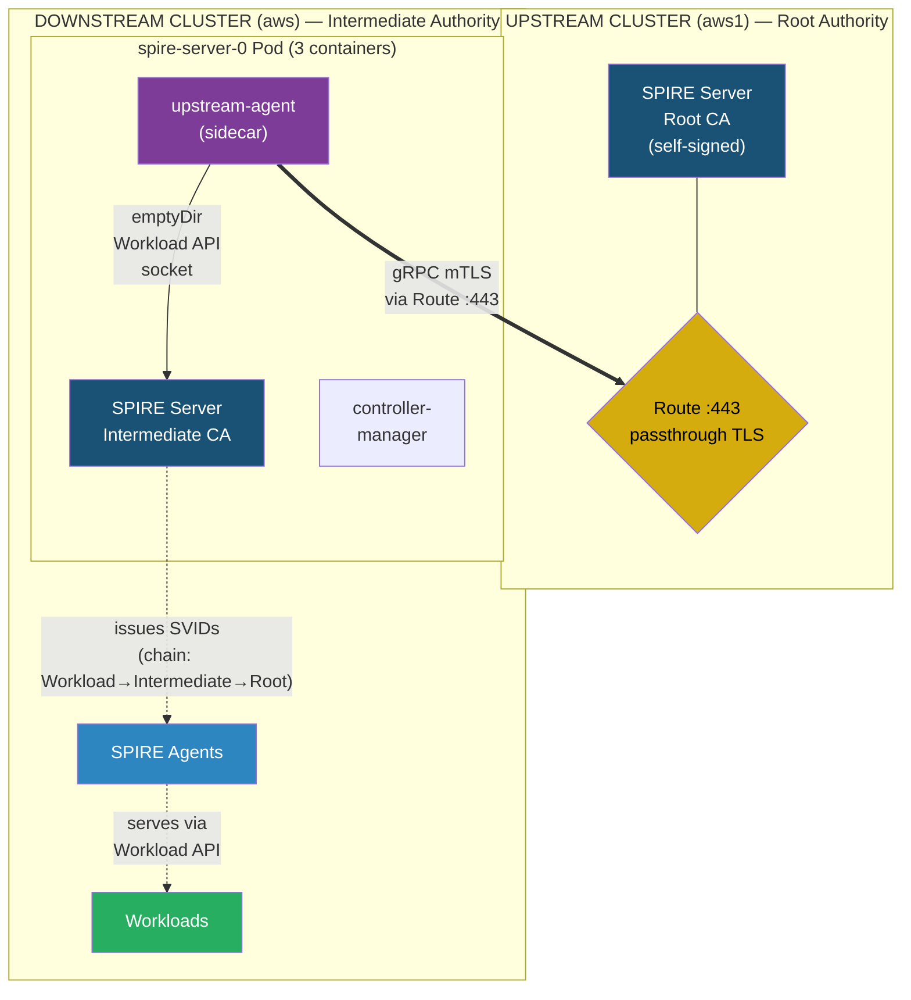

### Certificate Chain Produced

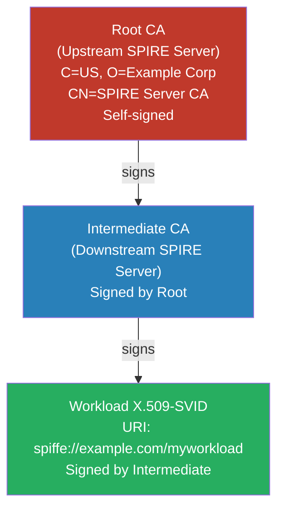

**What varies between approaches:** The _attestation method_ used by the upstream-agent sidecar to prove its identity to the upstream SPIRE server, and the _trust bundle distribution_ method.

---

## 2. Common Infrastructure

These resources are identical across all approaches.

### 2.1 Upstream Cluster (aws1) — Base Resources

| Resource | Kind | Purpose |
|----------|------|---------|
| `spire-server` | StatefulSet | SPIRE Server acting as Root CA |
| `spire-server` | ConfigMap | `server.conf` with NodeAttestor + UpstreamAuthority config |
| `spire-server-external` | Service | ClusterIP targeting gRPC port 8081 |
| `spire-server` | Route | Passthrough Route (:443 → :8081) for cross-cluster gRPC |
| `spire-agent` | DaemonSet | Local SPIRE agents (k8s_psat attestation) |
| Registration entry | SPIRE | `spiffe://example.com/downstream/spire-server` with `-downstream` flag |

### 2.2 Downstream Cluster (aws) — Base Resources

| Resource | Kind | Purpose |
|----------|------|---------|
| `spire-server` | StatefulSet | 3 containers: `spire-server` + `controller-manager` + `upstream-agent` sidecar |
| `spire-server` | ConfigMap | `server.conf` with `UpstreamAuthority "spire"` plugin |
| `upstream-agent-config` | ConfigMap/Secret | Sidecar agent configuration (`agent.conf`) |
| `upstream-bundle` | ConfigMap/Secret | Upstream root CA trust bundle |
| `spire-agent` | DaemonSet | Local agents receiving intermediate-signed SVIDs |
| `spiffe-csi-driver` | DaemonSet | CSI driver for Workload API socket projection |

### 2.3 Downstream `server.conf` — UpstreamAuthority Block (all approaches)

```json
"UpstreamAuthority": [{
    "spire": {
        "plugin_data": {
            "server_address": "localhost",
            "server_port": "8443",
            "workload_api_named_pipe_name": "/run/spire/upstream-agent/spire-agent.sock"
        }
    }
}]
```

### 2.4 Volumes in Downstream Pod (all approaches)

| Volume | Type | Written By | Read By |
|--------|------|-----------|---------|
| `upstream-agent-socket` | emptyDir | upstream-agent sidecar | spire-server |
| `upstream-agent-config` | ConfigMap or Secret | — | upstream-agent sidecar |
| `upstream-bundle` | ConfigMap or Secret | — | upstream-agent sidecar |
| `upstream-agent-data` | emptyDir | upstream-agent sidecar | — |
| `upstream-agent-token` | projected SA token | kubelet | upstream-agent sidecar |

### 2.5 CREATE_ONLY_MODE

All testing was performed with `CREATE_ONLY_MODE=true` set on the ZTWIM operator Subscription to prevent operator reconciliation from overwriting manual ConfigMap/StatefulSet changes:

```bash
oc patch subscription openshift-zero-trust-workload-identity-manager \
  -n zero-trust-workload-identity-manager --type=merge \
  -p '{"spec":{"config":{"env":[{"name":"CREATE_ONLY_MODE","value":"true"}]}}}'
```

---

## 3. Approach 1: k8s_psat Attestation

### What It Is

The sidecar agent presents a Kubernetes Projected Service Account Token (PSAT) to the upstream SPIRE server. The upstream server calls the `TokenReview` API against the downstream cluster's API server to validate the token, using a kubeconfig stored as a Secret.

### Additional Resources Required

| Resource | Cluster | Details |
|----------|---------|---------|
| ServiceAccount `spire-upstream-auth` | Downstream | For cross-cluster authentication |
| ClusterRoleBinding | Downstream | Grants `system:auth-delegator` (TokenReview) + pods/nodes read |
| Secret `remote-cluster-kubeconfig` | Upstream | Contains kubeconfig pointing to downstream API server |
| Volume mount in StatefulSet | Upstream | Mounts kubeconfig at `/run/spire/remote-cluster-creds/` |

### Configuration

**Upstream `server.conf` — NodeAttestor:**
```json
"NodeAttestor": [{
    "k8s_psat": {
        "plugin_data": {
            "clusters": [
                {
                    "prod-cluster": {
                        "service_account_allow_list": ["zero-trust-workload-identity-manager:spire-agent"],
                        "audience": ["spire-server"]
                    }
                },
                {
                    "downstream-cluster-aws": {
                        "service_account_allow_list": ["zero-trust-workload-identity-manager:spire-server"],
                        "kube_config_file": "/run/spire/remote-cluster-creds/kubeconfig",
                        "audience": ["spire-server"]
                    }
                }
            ]
        }
    }
}]
```

**Downstream sidecar `agent.conf`:**
```json
{
    "agent": {
        "data_dir": "/run/spire/data",
        "log_level": "DEBUG",
        "server_address": "spire-server-zero-trust-workload-identity-manager.apps.aagnihot-cluster-ewlk.devcluster.openshift.com",
        "server_port": "443",
        "socket_path": "/run/spire/upstream-agent/spire-agent.sock",
        "trust_bundle_path": "/run/spire/bundle/bundle.crt",
        "trust_domain": "example.com"
    },
    "plugins": {
        "KeyManager": [{"disk": {"plugin_data": {"directory": "/run/spire/data"}}}],
        "NodeAttestor": [{"k8s_psat": {"plugin_data": {"cluster": "downstream-cluster-aws"}}}],
        "WorkloadAttestor": [{"unix": {"plugin_data": {}}}]
    }
}
```

### Sequence Diagram

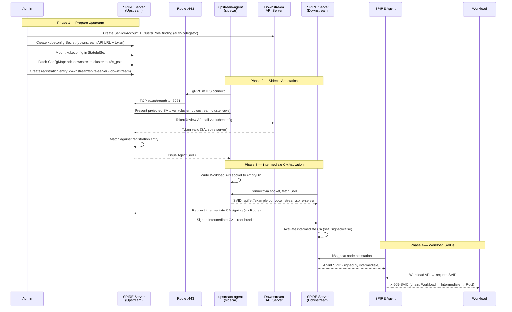

### Proof of Success

```
Sidecar log:
  Node attestation was successful
  reattestable=true
  spiffe_id="spiffe://example.com/spire/agent/k8s_psat/downstream-cluster-aws/<nodeUID>"

Downstream SPIRE Server:
  X509 CA prepared   self_signed=false  upstream_authority_id=29def2ea...
  X509 CA activated  upstream_authority_id=29def2ea...

Bundle show:
  subject=C=US, O=Example Corp, CN=SPIRE Server CA  ← from upstream root
  issuer=C=US, O=Example Corp, CN=SPIRE Server CA   ← self-signed root
```

### Pros and Cons

| Pros | Cons |
|------|------|
| Native Kubernetes authentication via RBAC | Heaviest cross-cluster dependency (5+ resources) |
| Reattestable — survives pod restarts/rescheduling | Requires kubeconfig with `system:auth-delegator` |
| Strong identity binding to specific ServiceAccounts | Long-lived token with API server access |
| Well-understood Kubernetes security model | Not air-gap compatible (needs runtime API access) |
| | Token expiry breaks attestation for new agents |
| | Must discover exact agent SPIFFE ID (includes node UID) for parent ID |

### OpenShift-Specific Issues

- Registration entry selector must use `unix:uid:<UID>` where UID is the random UID assigned by OpenShift SCC (e.g., `1000730000`), not `0`
- Parent ID must match the exact attested agent SPIFFE ID (including the node UID suffix from k8s_psat)

---

## 4. Approach 2: join_token Attestation

### What It Is

A one-time opaque token is generated on the upstream SPIRE server. The sidecar agent presents this token during initial attestation. Once used, the token is consumed and cannot be reused.

### Additional Resources Required

| Resource | Cluster | Details |
|----------|---------|---------|
| Token (generated via CLI) | Upstream | `spire-server token generate -spiffeID ...` |
| Agent config with join_token | Downstream | Token string in `agent.conf` `join_token` field |

**No kubeconfig. No ServiceAccount. No RBAC. No cross-cluster API access.**

### Configuration

**Upstream `server.conf` — NodeAttestor (add alongside k8s_psat):**
```json
"NodeAttestor": [
    {"k8s_psat": {"plugin_data": {"clusters": [...]}}},
    {"join_token": {"plugin_data": {}}}
]
```

**Token generation on upstream:**
```bash
oc exec spire-server-0 -n zero-trust-workload-identity-manager -c spire-server -- \
    /spire-server token generate \
    -spiffeID spiffe://example.com/downstream/spire-agent \
    -ttl 3600
```
Output: `Token: 20aa50b0-7e67-45bd-a2c5-f3e0398d36f0`

**Downstream sidecar `agent.conf`:**
```json
{
    "agent": {
        "join_token": "20aa50b0-7e67-45bd-a2c5-f3e0398d36f0",
        "data_dir": "/run/spire/data",
        "log_level": "DEBUG",
        "server_address": "spire-server-zero-trust-workload-identity-manager.apps.aagnihot-cluster-ewlk.devcluster.openshift.com",
        "server_port": "443",
        "socket_path": "/run/spire/upstream-agent/spire-agent.sock",
        "trust_bundle_path": "/run/spire/bundle/bundle.crt",
        "trust_domain": "example.com"
    },
    "plugins": {
        "KeyManager": [{"disk": {"plugin_data": {"directory": "/run/spire/data"}}}],
        "NodeAttestor": [{"join_token": {"plugin_data": {}}}],
        "WorkloadAttestor": [{"unix": {"plugin_data": {}}}]
    }
}
```

### Sequence Diagram

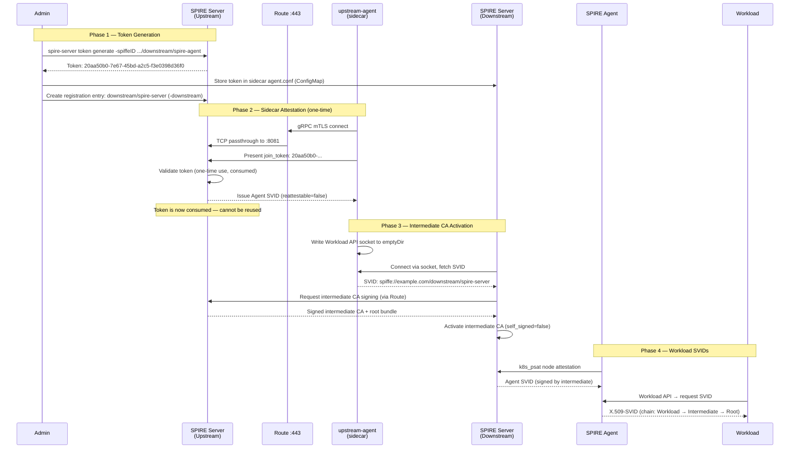

### Proof of Success

```
Sidecar log:
  Node attestation was successful
  reattestable=false
  spiffe_id="spiffe://example.com/spire/agent/join_token/20aa50b0-..."

Downstream SPIRE Server:
  X509 CA activated  upstream_authority_id=29def2ea...

Registration entry verification:
  spire-server entry show → entry_id=<hash>, spiffe_id=spiffe://example.com/downstream/spire-server
```

### Pros and Cons

| Pros | Cons |
|------|------|
| Simplest cross-cluster credential (one opaque string) | One-time use: pod deletion requires new token |
| No API server access from either direction | NOT reattestable (reattestable=false) |
| No kubeconfig, no SA, no RBAC | Token has TTL — agent must attest before expiry |
| Works in air-gapped environments | Admin must run CLI on upstream to generate each token |
| Token transferable via any channel (CLI, Vault, RHACM) | Not suitable for large-scale automation |

### OpenShift-Specific Issues

- Same `unix:uid` constraint as k8s_psat (must use the OpenShift-assigned UID, e.g., `1000730000`)
- Parent ID uses the `-spiffeID` value passed to `token generate`

---

## 5. Approach 3: x509pop Attestation

### What It Is

The sidecar agent proves its identity using a pre-provisioned X.509 certificate. The upstream server trusts a CA, and the sidecar agent presents a certificate signed by that CA along with a proof-of-possession challenge.

### Additional Resources Required

| Resource | Cluster | Details |
|----------|---------|---------|
| CA certificate (`agent-ca.crt`) | Upstream | Mounted as ConfigMap, referenced by `ca_bundle_path` |
| Agent cert + key (`agent.crt`, `agent.key`) | Downstream | Mounted as Secret, referenced in agent.conf |

**No kubeconfig. No API server access. No ServiceAccount. No RBAC.**

### Configuration

**Certificate generation (critical: `digitalSignature` key usage is mandatory):**
```bash
# Agent CA
openssl genrsa -out agent-ca.key 2048
openssl req -new -x509 -key agent-ca.key -out agent-ca.crt -days 365 \
    -subj "/C=US/O=SPIRE Test/CN=Agent CA" \
    -addext "keyUsage=keyCertSign,cRLSign,digitalSignature" \
    -addext "basicConstraints=critical,CA:TRUE"

# Agent certificate (MUST include digitalSignature)
openssl genrsa -out agent.key 2048
openssl req -new -key agent.key -out agent.csr \
    -subj "/C=US/O=SPIRE Test/CN=Downstream Agent"

cat > agent-ext.cnf <<EOF
keyUsage = critical,digitalSignature,keyEncipherment
basicConstraints = CA:FALSE
EOF

openssl x509 -req -in agent.csr -CA agent-ca.crt -CAkey agent-ca.key \
    -CAcreateserial -out agent.crt -days 365 -extfile agent-ext.cnf
```

**Upstream `server.conf` — NodeAttestor:**
```json
"NodeAttestor": [
    {"k8s_psat": {"plugin_data": {"clusters": [...]}}},
    {"x509pop": {"plugin_data": {
        "ca_bundle_path": "/run/spire/x509pop-ca/agent-ca.crt"
    }}}
]
```

**Downstream sidecar `agent.conf`:**
```json
{
    "agent": {
        "data_dir": "/run/spire/data",
        "log_level": "DEBUG",
        "server_address": "spire-server-zero-trust-workload-identity-manager.apps.aagnihot-cluster-ewlk.devcluster.openshift.com",
        "server_port": "443",
        "socket_path": "/run/spire/upstream-agent/spire-agent.sock",
        "trust_bundle_path": "/run/spire/bundle/bundle.crt",
        "trust_domain": "example.com"
    },
    "plugins": {
        "KeyManager": [{"disk": {"plugin_data": {"directory": "/run/spire/data"}}}],
        "NodeAttestor": [{"x509pop": {"plugin_data": {
            "private_key_path": "/run/spire/x509pop-cert/agent.key",
            "certificate_path": "/run/spire/x509pop-cert/agent.crt"
        }}}],
        "WorkloadAttestor": [{"unix": {"plugin_data": {}}}]
    }
}
```

### Sequence Diagram

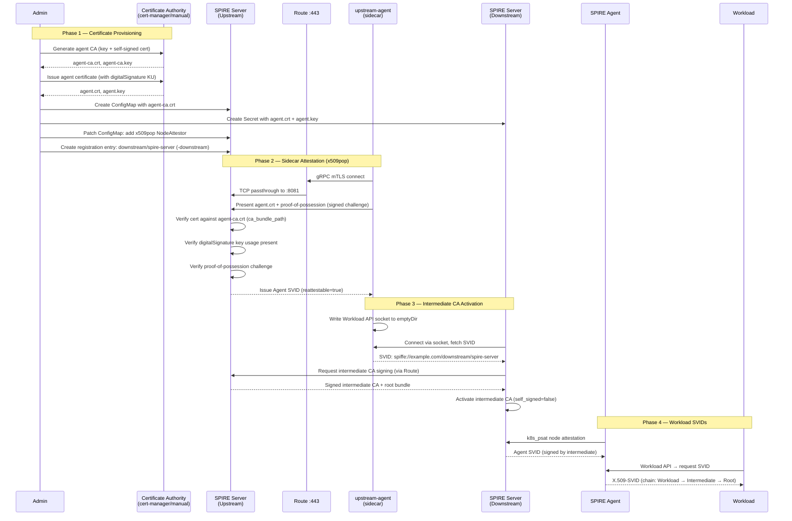

### Proof of Success

```
Sidecar log:
  Node attestation was successful
  reattestable=true
  spiffe_id="spiffe://example.com/spire/agent/x509pop/d0e7d44f..."

Downstream SPIRE Server:
  X509 CA activated  upstream_authority_id=29def2ea...

Certificate chain verification:
  openssl s_client → depth=1: C=US, O=Example Corp, CN=SPIRE Server CA (upstream root)
                     depth=0: C=US, O=Example Corp, CN=SPIRE Server CA (downstream intermediate)
```

### Pros and Cons

| Pros | Cons |
|------|------|
| Reattestable — survives pod restarts/rescheduling | Cert generation needed (more complex than join_token) |
| No cross-cluster API access at all | `digitalSignature` key usage MANDATORY — plain certs fail |
| Any CA can issue (cert-manager, Vault, manual) | Registration entry parent ID includes cert SHA1 fingerprint |
| Same CA can serve multiple downstream clusters | Parent ID changes on cert rotation |
| Standard PKI rotation practices apply | Need CA + cert/key distribution to both clusters |
| Works in air-gapped environments | |

### OpenShift-Specific Issues

- Same `unix:uid` constraint (use OpenShift-assigned UID)
- Agent cert/key stored as Kubernetes Secret on downstream
- CA cert stored as ConfigMap on upstream
- Can leverage cert-manager (already supported by ZTWIM) to issue certificates

---

## 6. Approach 4: Bundle Endpoint + insecure_bootstrap

### What It Is

Instead of manually copying the upstream trust bundle to the downstream cluster, the upstream SPIRE server exposes its trust bundle over an HTTPS endpoint. The downstream sidecar can either fetch the bundle from this endpoint or use `insecure_bootstrap` (Trust On First Use) to skip bundle verification entirely during initial connection.

**Note:** This is not an attestation method — it is a **trust bundle distribution** method that complements any attestation approach.

### Additional Resources Required

| Resource | Cluster | Details |
|----------|---------|---------|
| Service `spire-bundle-endpoint` | Upstream | ClusterIP targeting port 8443 |
| Route `spire-bundle-endpoint` | Upstream | Passthrough Route for bundle HTTPS |
| ConfigMap patch (federation block) | Upstream | Enable `bundle_endpoint` in server.conf |

### Configuration

**Upstream `server.conf` — Federation block:**
```json
"server": {
    "federation": {
        "bundle_endpoint": {
            "address": "0.0.0.0",
            "port": 8443,
            "profile": [{"https_spiffe": {}}]
        }
    }
}
```

**Upstream Service + Route:**
```yaml
apiVersion: v1
kind: Service
metadata:
  name: spire-bundle-endpoint
  namespace: zero-trust-workload-identity-manager
spec:
  selector:
    app.kubernetes.io/name: spire-server
  ports:
  - name: bundle
    port: 8443
    targetPort: 8443
---
apiVersion: route.openshift.io/v1
kind: Route
metadata:
  name: spire-bundle-endpoint
  namespace: zero-trust-workload-identity-manager
spec:
  port:
    targetPort: bundle
  tls:
    termination: passthrough
  to:
    kind: Service
    name: spire-bundle-endpoint
```

**Downstream sidecar `agent.conf` (with insecure_bootstrap):**
```json
{
    "agent": {
        "insecure_bootstrap": true,
        "data_dir": "/run/spire/data",
        "server_address": "spire-server-...",
        "server_port": "443",
        "socket_path": "/run/spire/upstream-agent/spire-agent.sock",
        "trust_domain": "example.com"
    }
}
```

### Sequence Diagram

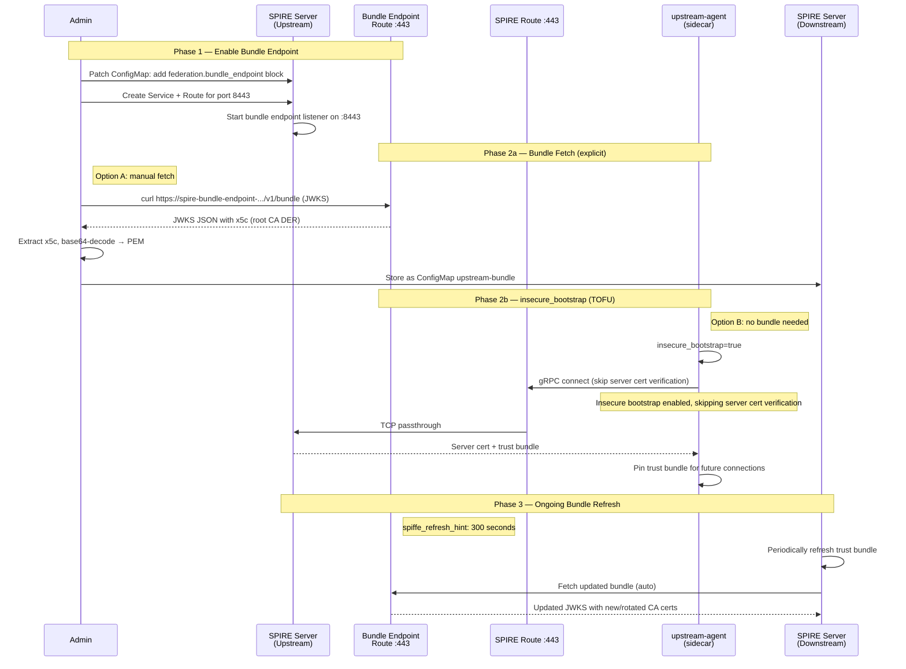

### Bundle Endpoint Response (JWKS Format)

```json
{
    "keys": [
        {"use": "x509-svid", "kty": "RSA", "x5c": ["<base64-DER-cert>"]},
        {"use": "jwt-svid", "kty": "RSA", "kid": "..."}
    ],
    "spiffe_sequence": 1,
    "spiffe_refresh_hint": 300
}
```

### Proof of Success

```
Bundle endpoint:
  curl https://spire-bundle-endpoint-... → HTTP 200, valid JWKS JSON
  spiffe_sequence: 1
  spiffe_refresh_hint: 300
  x5c: <upstream root CA in base64 DER>

insecure_bootstrap:
  Sidecar log: "Insecure bootstrap enabled; skipping server certificate verification"
  Sidecar log: Node attestation was successful (x509pop, without any trust bundle file)
  SVID chain valid: Workload → Intermediate → Root
```

### Pros and Cons

| Pros | Cons |
|------|------|
| Eliminates manual trust bundle copy between clusters | `https_spiffe` profile requires client to already trust the bundle |
| Auto-refresh via `spiffe_refresh_hint` | `insecure_bootstrap` is TOFU — vulnerable to MITM on first connect |
| `insecure_bootstrap` = zero trust bundle management | Requires additional Service + Route on upstream |
| Operator can auto-fetch bundle on reconciliation | `https_web` profile needs web PKI cert (ACME/serving cert) |
| Low operational overhead | |

### Trust Bundle Distribution Comparison

| Method | Security | Complexity | Automation |
|--------|----------|-----------|------------|
| Manual ConfigMap copy | High (explicit trust) | High | Low |
| Bundle endpoint fetch | Medium (TOFU unless pinned) | Low | High |
| `insecure_bootstrap` | Low (TOFU, no verification) | Lowest | Highest |
| ESO from Vault | High (central store) | Medium | High |

---

## 7. Approach 5: ESO + Vault Secret Management

### What It Is

Instead of manually creating ConfigMaps and Secrets for the SPIRE cross-cluster credentials, the External Secrets Operator (ESO) syncs them from a central HashiCorp Vault instance. ESO periodically refreshes, enabling automatic secret rotation without manual intervention.

**Note:** This is a **secret distribution** method that complements any attestation approach. In our test, it was combined with x509pop attestation.

### Additional Resources Required

| Resource | Cluster | Details |
|----------|---------|---------|
| Vault Deployment + Service | Downstream (or shared) | HashiCorp Vault 1.15 (dev mode) |
| Red Hat ESO Operator | Downstream | `openshift-external-secrets-operator` |
| `ExternalSecretsConfig` CR | Downstream | Required to deploy ESO controller pods |
| NetworkPolicy `allow-vault-egress` | Downstream (`external-secrets` ns) | Allow ESO → Vault connectivity |
| Secret `vault-token` | Downstream (SPIRE ns) | Vault auth token for ESO |
| ClusterSecretStore `vault-backend` | Downstream | Points to Vault |
| 3x ExternalSecret | Downstream (SPIRE ns) | Sync bundle, cert/key, agent config |

### Vault Secret Structure

| Vault Path | Keys | Content |
|------------|------|---------|
| `secret/data/spire/upstream-bundle` | `bundle.crt` | Upstream root CA (PEM) |
| `secret/data/spire/x509pop-agent-cert` | `agent.crt`, `agent.key` | x509pop agent certificate + key |
| `secret/data/spire/upstream-agent-config` | `agent.conf` | Sidecar agent configuration JSON |

### Configuration

**ClusterSecretStore:**
```yaml
apiVersion: external-secrets.io/v1
kind: ClusterSecretStore
metadata:
  name: vault-backend
spec:
  provider:
    vault:
      server: "http://vault.vault.svc.cluster.local:8200"
      path: "secret"
      version: "v2"
      auth:
        tokenSecretRef:
          name: vault-token
          namespace: zero-trust-workload-identity-manager
          key: token
```

**ExternalSecret (example — upstream-bundle):**
```yaml
apiVersion: external-secrets.io/v1
kind: ExternalSecret
metadata:
  name: upstream-bundle
  namespace: zero-trust-workload-identity-manager
spec:
  refreshInterval: 1m
  secretStoreRef:
    name: vault-backend
    kind: ClusterSecretStore
  target:
    name: upstream-bundle
    creationPolicy: Owner
    template:
      type: Opaque
      data:
        bundle.crt: "{{ .bundlecrt }}"
  data:
  - secretKey: bundlecrt
    remoteRef:
      key: spire/upstream-bundle
      property: bundle.crt
```

**NetworkPolicy (required — ESO ships with deny-all):**
```yaml
apiVersion: networking.k8s.io/v1
kind: NetworkPolicy
metadata:
  name: allow-vault-egress
  namespace: external-secrets
spec:
  podSelector:
    matchLabels:
      app.kubernetes.io/name: external-secrets
  policyTypes: [Egress]
  egress:
  - to:
    - namespaceSelector:
        matchLabels:
          kubernetes.io/metadata.name: vault
      podSelector:
        matchLabels:
          app: vault
    ports:
    - {protocol: TCP, port: 8200}
```

### Sequence Diagram

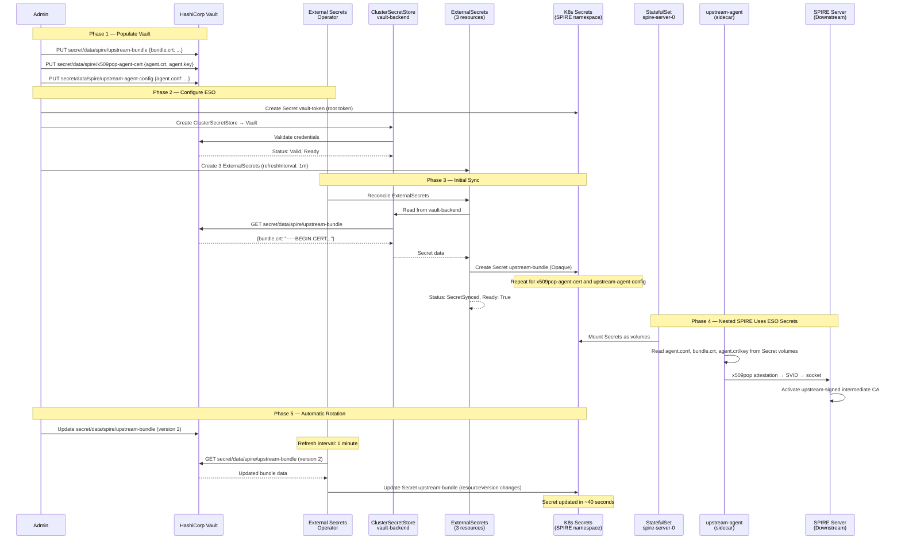

### Proof of Success

```
ESO Sync:
  NAME                    STORE           STATUS         READY
  upstream-agent-config   vault-backend   SecretSynced   True
  upstream-bundle         vault-backend   SecretSynced   True
  x509pop-agent-cert      vault-backend   SecretSynced   True

Nested SPIRE:
  upstream-agent: Received 1 svid (spiffe://example.com/downstream/spire-server)
  SPIRE Server: Active X.509 authority
    Upstream authority Subject Key ID: 29def2ea788744d9a3682edf49a2dd656c31b35d

Rotation test:
  1. Updated upstream-bundle in Vault → version 2
  2. ESO auto-synced in ~40 seconds
  3. Downstream Secret resourceVersion changed
  4. Marker text "# ESO rotation test marker: 20260311T114620Z" confirmed in synced Secret
```

### Pros and Cons

| Pros | Cons |
|------|------|
| Centralized secret management (single source of truth) | Requires Vault infrastructure (deploy, HA, backup, unseal) |
| Automatic rotation via ESO refresh (configurable 1m–24h) | Requires ESO operator + `ExternalSecretsConfig` CR |
| Auditable access through Vault audit log | NetworkPolicy changes needed (ESO deny-all default) |
| Declarative — ExternalSecret CRs, GitOps-friendly | ESO creates Secrets not ConfigMaps (patch StatefulSet) |
| Works with any Vault auth (token, AppRole, K8s auth) | Higher complexity vs manual copy for small deployments |
| Eliminates manual `oc create secret/configmap` | Cross-cluster Vault access may be blocked (VPC rules) |

### OpenShift-Specific Issues

1. **`ExternalSecretsConfig` CR required**: Red Hat ESO needs `ExternalSecretsConfig` (apiVersion `operator.openshift.io/v1alpha1`, name `cluster`) to deploy controller pods
2. **Default deny-all NetworkPolicy**: ESO namespace has `deny-all-traffic` policy; must add explicit egress for Vault
3. **ESO creates Secrets only**: ExternalSecrets always produce K8s Secrets; StatefulSet volumes using `configMap` must be changed to `secret`

---

## 8. Side-by-Side Comparison

### Quick Reference Matrix

| | k8s_psat | join_token | x509pop | Bundle EP | ESO + Vault |
|---|---------|-----------|---------|-----------|-------------|
| **Type** | Attestation | Attestation | Attestation | Trust dist. | Secret dist. |
| **Result** | PASS | PASS | PASS | PASS | PASS |
| **Reattestable** | Yes | No | Yes | N/A | N/A |
| **Cross-cluster API** | Yes (TokenReview) | No | No | No | No (Vault API) |
| **Credentials needed** | Kubeconfig + SA | One token | Cert + key | None | Vault token |
| **Air-gap** | No | Yes | Yes | Yes | No |
| **Setup complexity** | High | Low | Medium | Low | Medium-High |
| **Automation** | Medium | Low | Medium | High | High |
| **cert-manager synergy** | No | No | Yes | No | Yes |
| **Vault synergy** | No | No | Yes | No | Native |
| **RHACM synergy** | Yes | Yes | Yes | Yes | Yes |

### Complexity vs. Resilience

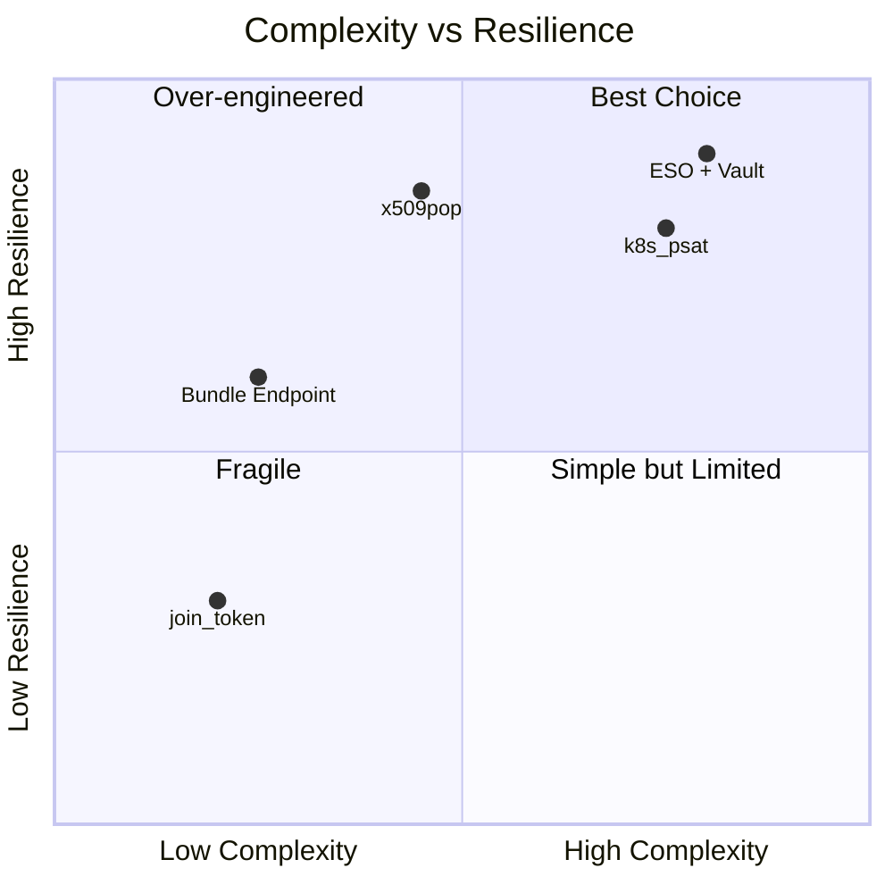

### Recommended Combinations

| Profile | Attestation | Trust Bundle | Secret Mgmt | Why |
|---------|------------|-------------|-------------|-----|
| **Dev/PoC** (2-3 clusters) | `join_token` | Manual copy | Manual | Fastest to set up, acceptable trade-offs |
| **Small** (3-10 clusters) | `x509pop` | `insecure_bootstrap` | Manual or Vault | Reattestable, no cross-cluster API, simple |
| **Medium** (10-20 clusters) | `x509pop` | Bundle endpoint | ESO + Vault | Automated rotation, auditable |
| **Enterprise** (20+ clusters) | `x509pop` | Bundle endpoint | ESO + Vault + RHACM | Full automation, policy-driven |

---

## 9. Can the Sidecar Be Removed?

All five approaches tested above use a **sidecar container** (upstream-agent) in the downstream spire-server pod. This section analyzes whether the sidecar can be eliminated, and what alternatives exist.

### Why the Sidecar Exists

The `UpstreamAuthority "spire"` plugin communicates over a **Workload API Unix domain socket**. It cannot make a direct gRPC call to the upstream SPIRE server. A SPIRE agent must:

1. Attest to the upstream SPIRE server (via Route)
2. Receive an SVID (X.509 identity)
3. Expose a local Workload API socket
4. The downstream `spire-server` reads that socket to request intermediate CA signing

There is **no configuration flag** to make the `"spire"` plugin connect directly over the network — the Unix socket is a hard requirement in the SPIRE codebase.

### Three Paths to Remove (or Relocate) the Sidecar

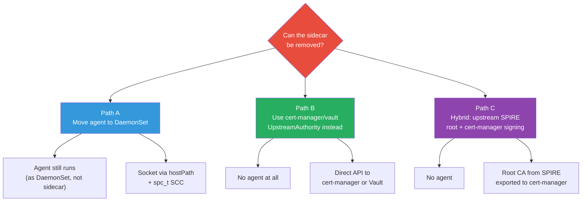

#### Path A — Keep the Agent, Move to DaemonSet

Instead of a sidecar, run the upstream agent as a **DaemonSet** on the downstream cluster. The Workload API socket is shared via `hostPath` volume instead of `emptyDir`.

**How it works:**
- DaemonSet runs one upstream-agent pod per node
- Agent writes socket to a `hostPath` directory (e.g., `/run/spire/upstream-agent/`)
- The `spire-server` StatefulSet mounts the same `hostPath` to read the socket

**OpenShift constraint:** The CSI driver cannot be used for this due to SELinux MCS label restrictions. A custom SCC with `spc_t` SELinux type is required for the `hostPath` mount:

```yaml
securityContext:
  seLinuxOptions:
    type: spc_t
```

**Verdict:** Agent still runs (just not as a sidecar). Operationally cleaner — agent lifecycle is independent of the server pod. But adds DaemonSet + SCC complexity on OpenShift.

#### Path B — Remove the Agent Entirely (Different UpstreamAuthority)

If you use `UpstreamAuthority "cert-manager"` or `UpstreamAuthority "vault"` instead of `"spire"`, **no agent is needed at all**. The downstream SPIRE server contacts the CA signing backend directly:

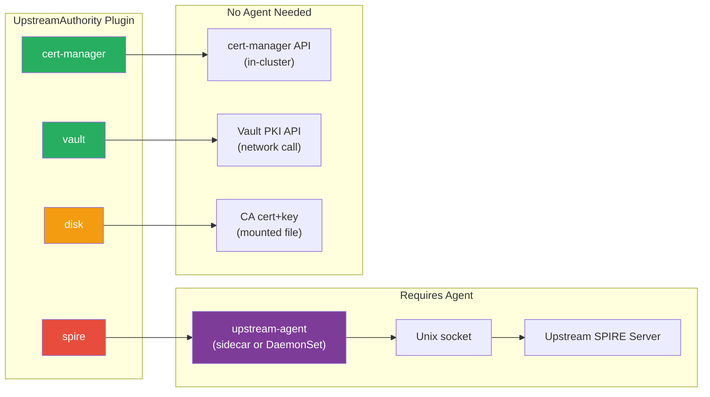

| Plugin | Agent Required | How It Signs Intermediate CA | Auto-Rotation | Customer Reach |
|--------|---------------|------------------------------|---------------|----------------|
| `spire` | Yes (sidecar or DaemonSet) | Via Workload API socket to upstream server | Yes (SPIRE protocol) | Advanced multi-cluster |
| `cert-manager` | **No** | Direct API call to cert-manager (in-cluster) | Yes (cert-manager renew) | **Everyone** |
| `vault` | **No** | Direct API call to Vault PKI engine | Yes (Vault TTL) | Enterprise |
| `disk` | **No** | Reads CA cert/key from mounted file | No (manual rotation) | Dev/PoC |

**Verdict:** For customers who don't need a unified multi-cluster SPIRE trust hierarchy, `cert-manager` or `vault` completely eliminates the sidecar and all cross-cluster dependencies.

#### Path C — Hybrid: SPIRE Root + cert-manager Signing

This combines the best of both worlds for customers who want a centralized SPIRE root CA **without** the sidecar complexity:

1. **Upstream SPIRE server** generates and owns the root CA (self-signed)
2. **Export** the root CA cert/key to `cert-manager` as a `CA` Issuer (or to Vault as a PKI mount)
3. **Downstream SPIRE servers** use `UpstreamAuthority "cert-manager"` — no sidecar, no agent, no cross-cluster socket
4. Certificate chain is still: **Root (upstream) → Intermediate (downstream) → Workload SVIDs**

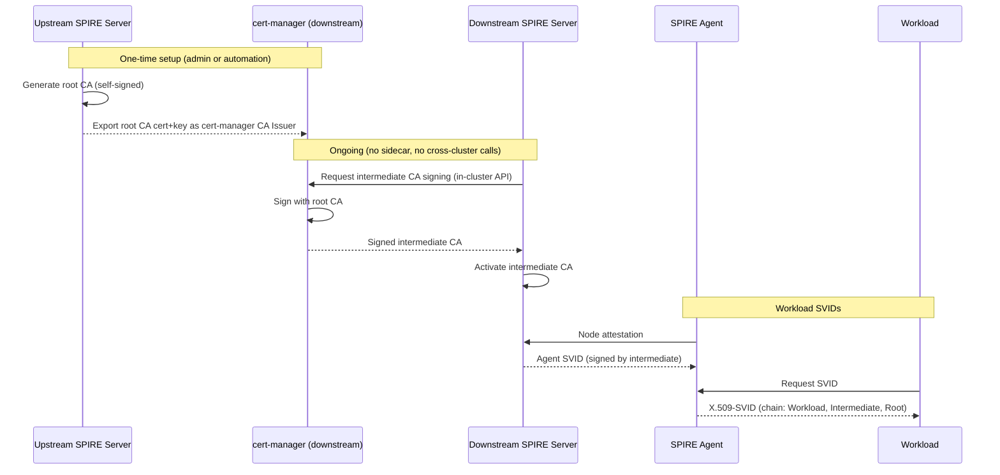

**Verdict:** Most practical for the TL/PM's goal of serving all customers. Preserves trust hierarchy. Zero cross-cluster runtime dependencies. cert-manager is already a ZTWIM dependency.

### Sidecar vs. No-Sidecar Decision Matrix

| Criterion | With Sidecar (`spire`) | Without Sidecar (`cert-manager`) | Without Sidecar (`vault`) |
|-----------|----------------------|--------------------------------|--------------------------|
| **Agent process** | Required (sidecar or DaemonSet) | None | None |
| **Cross-cluster network** | gRPC via Route (runtime) | None (in-cluster only) | Vault API (if external) |
| **CA signing protocol** | SPIRE Workload API | cert-manager API (K8s native) | Vault PKI API |
| **Auto CA rotation** | Yes (SPIRE handles it) | Yes (cert-manager renew) | Yes (Vault TTL) |
| **Unified trust domain** | Yes (same SPIRE hierarchy) | No (cert-manager manages independently) | No (Vault manages independently) |
| **Extra components** | None (sidecar is inline) | cert-manager operator (already present) | Vault instance |
| **OpenShift complexity** | Medium (StatefulSet patch) | Low (operator-native) | Medium (Vault deploy/access) |
| **Failure blast radius** | Upstream outage blocks CA rotation | cert-manager outage blocks CA rotation | Vault outage blocks CA rotation |
| **Customer audience** | Advanced (multi-cluster SPIRE) | **Everyone** | Enterprise |
| **Operator isolation** | Needs Route to upstream cluster | Fully isolated within cluster | Needs Vault network access |

### Recommendation

For the ZTWIM operator's implementation:

1. **Default (all customers): `UpstreamAuthority "cert-manager"`** — No sidecar. No agent. No cross-cluster dependencies. cert-manager is already a ZTWIM dependency. Works for single-cluster and multi-cluster alike. The root CA can be a self-signed cert-manager Issuer, or imported from an external PKI or upstream SPIRE.

2. **Enterprise option: `UpstreamAuthority "vault"`** — No sidecar. Centralized PKI management via Vault. Audit logging. For customers with existing Vault infrastructure.

3. **Advanced multi-cluster option: `UpstreamAuthority "spire"` with sidecar** — For customers who specifically need a unified SPIRE trust domain hierarchy across clusters with dynamic CA rotation via the SPIRE protocol. The sidecar remains necessary here but is an opt-in, not the default.

---

## 10. Final Recommendation

**For the ZTWIM operator's UpstreamAuthority implementation — serving all customers:**

### Tier 1: Default (all customers, no sidecar)

**`UpstreamAuthority "cert-manager"`** — The operator's default UpstreamAuthority mode.

- No sidecar agent. No cross-cluster dependencies. No extra infrastructure.
- cert-manager is already a ZTWIM dependency — zero additional operator footprint.
- Root CA can be self-signed (cert-manager `SelfSigned` → `CA` Issuer chain) or imported from external PKI.
- Automatic CA rotation handled by cert-manager certificate renewal.
- Works for single-cluster and multi-cluster deployments alike.

### Tier 2: Enterprise (no sidecar)

**`UpstreamAuthority "vault"`** — For customers with centralized HashiCorp Vault.

- No sidecar agent. Direct Vault PKI API calls.
- Centralized PKI management, audit logging, policy enforcement.
- Automatic CA rotation via Vault certificate TTL.
- Optionally pair with ESO for automated Vault credential distribution.

### Tier 3: Advanced multi-cluster (sidecar required)

**`UpstreamAuthority "spire"` with sidecar** — For customers who need a unified SPIRE trust domain hierarchy across clusters.

- Sidecar (upstream-agent) is mandatory for this plugin.
- Recommended attestation: `x509pop` (reattestable, no cross-cluster API access).
- Recommended trust bundle: `insecure_bootstrap` (simplest) or bundle endpoint (auto-refresh).
- This is the only option that provides dynamic multi-cluster CA rotation via the SPIRE protocol.

### Principle

All three UpstreamAuthority plugins (`cert-manager`, `vault`, `spire`) should be configurable in the CRD. The operator defaults to `cert-manager` (Tier 1) to serve the broadest customer base with zero additional infrastructure. The sidecar is only injected when the user explicitly selects the `spire` plugin.